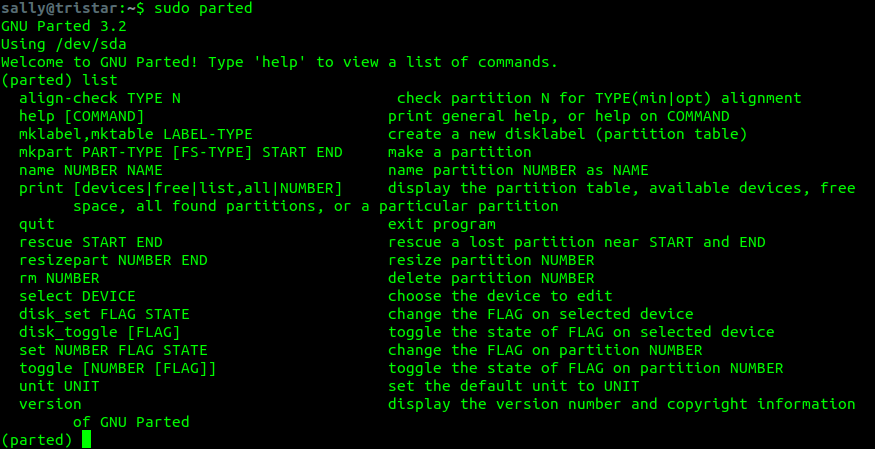
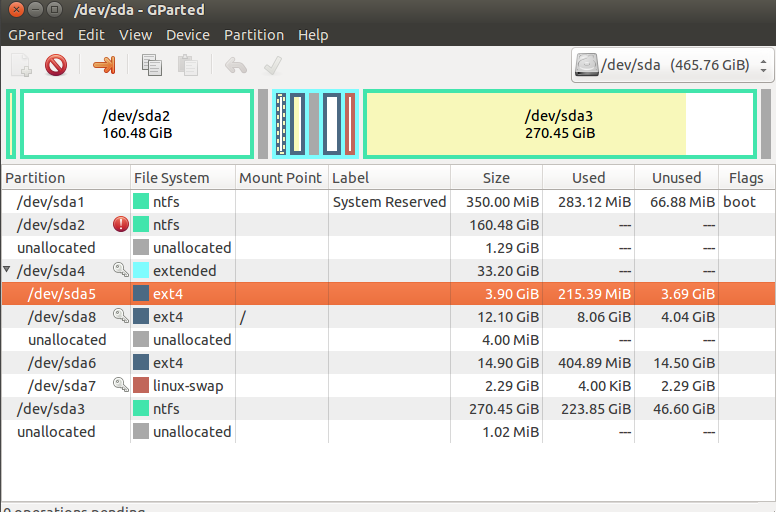

################
Disky a zařízení
################

    "V Linuxu je je vše soubor. Pokud to není soubor, je to proces."

    -- Kamenné pravidlo souborů v Linuxu

Druhy souborů
*************

Soubor v Linuxu má velmi široký význam a "běžný" soubor s textem, obrázkem ap. je jen jedním z druhů
souborů, které existují. První zvláštností je, že mezi soubory v Linuxu zahrnujeme tzv.
:ref:`souborová zařízení <souborova-zarizeni>` reprezentující různé hardwarové a jiné komponenty.
Rovněž složka je zvláštním druhem souboru, který obsahuje seznam jiných souborů.

Přístup "vše je soubor" má velké množství výhod, které postupně objevíme sami.

Typ souboru zobrazuje notoricky známý příkaz ``ls`` s volbou ``-l`` se kterou před oprávněním
souboru uvede jeho typ (první znak prvního sloupce). Např. ve výpisu domovské složky ``ls -l ~``
najdeme obyčejný soubor (``-``) a složky (``d``)::

    ...
    -rwxr-xr-x  2 sandy sandy    1053 Oct 25 23:40 pgadmin.log
    drwxr-xr-x  2 sandy sandy    4096 Oct 25 23:40 Pictures/
    drwxrwxr-x  4 sandy sandy    4096 Oct 13 10:00 snap/
    drwxrwxr-x  9 sandy sandy    4096 Oct 18 13:12 workspace/
    ...

.. tip:: Skoro jistě můžete místo ``ls -l`` používat ``ll``. Je to tzv. alias pro ``ls -l``.

Další druhy souborů najdete v tabulce.

.. csv-table:: Druhy souborů a odpovídající symboly ve výpisu ``ls -l``.
   :header: "Symbol v ``ls -l``", "Význam"
   :widths: 25, 75
   
   "``-``", "*normální soubor* s texty, obrázky, hudbou ap."
   "``d``", "*složka (directory)* - speciální soubor obsahující názvu jiných souborů"
   "``l``", "*symbolický odkaz (link)* na jiný soubor"
   "``c``", "*znakové (character) zařízení*. Viz `bloková a znaková zařízení`_."
   "``s``", "*doménový soket (domain socket)* je podobný soketům protokolu TCP/IP. Slouží jako prostředek interprocesové komunikace (IPC)."
   "``p``", "*pojmenovaná roura (named pipe)*. Podobně jako sokety jsou prostředkem pro IPC, ale bez sémantiky síťových socketů."
   "``b``", "*blokové zařízení*. Viz `bloková a znaková zařízení`_."

Oddíly a souborové systémy
**************************

Fyzický pevný disk může být rozdělen na více *oddílů (partitions)*. Oddíly jsou na sobě nezávislé a
pád nebo chyba jednoho neovlivní druhý. OS Linux v typické instalaci používá více oddílů.

Důvod je především historický, kdy ještě nebyly používány *žurnálovací souborové systémy
(filesystems)* a problém by mohl vést až ke ztrátě dat. Ale i dnes má rozdělení na více oddílů
význam. Databáze může např. nekontrolovaně zaplnit veškeré místo do posledního bajtu a zastavit
systém. Tím že jsou však soubory na jiném oddílu, než OS, nebude tím chod OS ovlivněný.

.. topic:: Žurnálovací file systémy

   Zabezpečují data před neočekávaným výpadkem napájení nebo odpojením zařízení tím, že zapisují
   změny nejprve do speciálního záznamu - žurnálu - a teprve pak skutečně na disk. Následně je údaj
   o úspěšné "realizaci" na disku zapsán do žurnálu a nakonec zrušen. Díky tomu je možné v případě
   přerušení vrátit stav na před operací nebo ji dokončit.

   Žurnálování nechrání však před chybami na disku a logickými chybami. Pro ochranu tohoto druhu
   slouží např. RAID.

   Staričký FAT žurnálový není. Jinak žurnálují takřka všechny moderní filesystémy: NTFS (Win), HFS+
   (Mac), všechny unixové a linuxové FS jako ext3, ext4, ReiserFS, XFS, JFS, ZFS.

Linux obvykle ke správné činnosti využívá nejméně dva druhy oddílů:

* *datový (běžný) oddíl* naformátovaný na některý z řady podporovaných souborových systémů pro
  ukládání dat OS nebo uživatelských dat. Běžných oddílů lze mít více.

* *odkládací (swap) oddíl*, který nemá žádné naformátování (je tzv. raw). Využívá ho OS při nedostatku RAM.
  Tento princip virtuální paměti podporují dnes všechny velké OS.

.. todo:: odkaz do předchozího dílu knihy:

.. ..tip:: Více o instalaci, vhodném rozvržení disku, volbě velikosti odkládacího oddílu naleznete v <<../usrv1/02-instalace.adoc>>.

Startování z disku
******************

.. todo:: tutu sekci "Startování z disku" bych viděl na odstranění?!

.. popis z "man fdisk":
   DISK LABELS
          GPT (GUID Partition Table)
                 GPT is modern standard for the layout of the partition table.  GPT uses 64-bit logical block addresses,  checksums,  UUIDs
                 and names for partitions and an unlimited number of partitions (although the number of partitions is usually restricted to
                 128 in many partitioning tools).

                 Note that the first sector is still reserved for a protective MBR in the GPT specification.  It prevents  MBR-only  parti‐
                 tioning tools from mis-recognizing and overwriting GPT disks.

                 GPT is always a better choice than MBR, especially on modern hardware with a UEFI boot loader.

          DOS-type (MBR)
                 A  DOS-type partition table can describe an unlimited number of partitions.  In sector 0 there is room for the description
                 of 4 partitions (called `primary').  One of these may be an extended partition; this is a box holding logical  partitions,
                 with descriptors found in a linked list of sectors, each preceding the corresponding logical partitions.  The four primary
                 partitions, present or not, get numbers 1-4.  Logical partitions are numbered starting from 5.

                 In a DOS-type partition table the starting offset and the size of each partition is stored in two  ways:  as  an  absolute
                 number of sectors (given in 32 bits), and as a Cylinders/Heads/Sectors triple (given in 10+8+6 bits).  The former is OK --
                 with 512-byte sectors this will work up to 2 TB.  The latter has two problems.  First, these C/H/S fields  can  be  filled
                 only  when the number of heads and the number of sectors per track are known.  And second, even if we know what these num‐
                 bers should be, the 24 bits that are available do not suffice.  DOS uses C/H/S only, Windows uses both, Linux  never  uses
                 C/H/S.  The C/H/S addressing is deprecated and may be unsupported in some later fdisk version.

                 Please, read the DOS-mode section if you want DOS-compatible partitions.  fdisk does not care about cylinder boundaries by
                 default.

Master Boot Record (MBR)
========================

MBR je bootovací sektor (512 bajtů) na úplném začátku disku. MBR obsahuje

* informace o rozdělení disku na logické oddíly obsahující souborové systémy
* proveditelný kód, tzv. boot loader, který většinou jen předá řízení skutečnému spouštěči jako GRUB

GUID Partition Table (GPT)
==========================

Koncept MBR pochází z roku 1983 a je postupně nahrazován GPT. GPT tabulku najdeme u všech moderních
strojů s UEFI firmwarem (nástupce BIOSu). Z GPT můžou bootovat všechny moderní OS včetně OS X a
Windows a samozřejmě Linuxu. Hlavní linuxové nástroje pro práci z disky byly aktualizovány pro
podporu GPT.

GRUB
====

GRUB je standardní boot loader většiny linuxových distribucí. Nahradil starší LILO (LInux LOader).
Je to "to menu po startu PC s výběrem OS". Umožňuje startovat nejen Linuxy, ale i DOS, Windows, BSD
a Solaris systémy.

.. todo:: screenshot GRUBu

.. _souborova-zarizeni:

Souborová zařízení
******************

Složka ``/dev/`` obsahuje speciální soubory reprezentující zařízení a komponenty připojená k
počítači. Kromě skutečného hardwaru jde i o různá pseudo a similovaná zařízení jako generátor
náhodných čísel ap.

.. Soubory zařízení se vytváří v průběhu instalace nebo dodatečně skriptem ``/dev/MAKEDEV`` a
   ``MAKEDEV.local`` (o této variantě se ale bavit nebudeme). -- Je toto k nečemu užitečné?

.. todo:: "zařízení můžete nastavovat vlastníka, skupinu a oprávnění" odkaz do I.

"Vše je soubor" je doslova geniální rozhodnutí. Zařízením můžete nastavovat
<<../usrv1/06-souborova-opravneni.adoc,vlastníka, skupinu a oprávnění>>, vytvoření image oddílu se
rovná čtení souboru zařízení oddílu, vytištění může být poslání na soubor zařízení tiskárny atd.

Bloková a znaková zařízení
==========================

Linux rozlišuje mezi znakovými a (běžnějšími) blokovými zařízeními.

Bloková (block device):

* umí "udržet" data
* disketa, pevný disk, USB flash paměť, USB disk ap.
* můžete číst/zapisovat jakýkoli blok bajtů
* bufferuje
* nevýhoda buferování je, že nevíte, že data byla už zapsána na zařízení
* náhodný přístup

Znaková (character device):

* slouží k "protékání" dat
* pásky, sériové linky
* nebufferovaný přímý přístup
* neznamená, že můžete číst/zapisovat jen po jednom znaku (toto rozhodnutí je na zařízení samotném)
* sekvenční přístup

Nejdůležitější zařízení v ``/dev/``
===================================

Následující výčet není v žádném případě úplný. Seznámíme se jen s některými nejdůležitějšími
skutečnými i pseudo zařízeními. Ne všechna musí být ve vašem Linuxu, resp. v počítači existovat.

.. note:: Některá zařízení a souborové zařízení jsou již pomalu počítačovým dávnověkem, ale
   přesto se domníváme, že stojí za to je zmínit.

.. rubric:: ``/dev/fd[0-9]``

První disketová jednotka je ``fd0``. Druhá ``fd1`` ap.

.. rubric:: ``/dev/hd[a-d]``

Pevné disky připojené přes IDE rozhraní. ``hda`` je primary master, ``hdb`` je primary slave,
``hdc`` secondary master, ``hdd`` secondary slave.

.. rubric:: ``/dev/hd[a-d][1-9]``

Oddíly na daném IDE disku. Oddíly 1-4 jsou primární oddíly. Oddíly 5+ jsou logické oddíly uvnitř
rozšířených oddílů. Takže např. ``hdb1`` je primární partition na primary master.

.. rubric:: ``/dev/lp[0-9]``

``lp0`` je první paralelní tiskárna ap.

.. rubric:: ``/dev/loop[0-9]``

Tzv. loopback zařízení jsou pseudozařízení sloužící ke zpřístupnění souboru jako blokového zařízení
(např. připojení .iso obrazu jako disku).

.. rubric:: ``/dev/null``

"Černá díra" ve které nenávratně zmizí cokoli tam zapíšete. Užitečnost tohoto zařízení je
hlavně pro skripty, kdy do černé díry přesměrujete výstup, která vás nezajímá.

.. code-block:: shell

   # stderr výstup findu nás nezajímá - přesměrován do černé díry
   # stdout bude stále na konzoli
   $ find / -name foo 2> /dev/null

.. rubric:: ``/dev/psaux``

PS/2 port.

.. rubric:: ``/dev/cdrom`` a ``/dev/dvd``

CD, resp. DVD mechanika. Jde o linky na konkrétní :ref:`sr* zařízení <sr-device>`.

.. rubric:: ``/dev/random`` a ``/dev/urandom``

Generátory náhodných čísel. ``random`` je nedeterministický, což znamená, že následující číslo nelze
odhadnout z předchozích čísel. ``urandom`` je "pouze" pseudonáhodný, ale taky rychlejší. Nezáleží
vám na vysoké bezpečnosti, postačí ``urandom``.

.. tip:: Příklady využití souborů ``random`` a ``uranom``.

   Chcete vytvořit umělé zatížení PC? Čtěte z ``urandom`` a posílejte ho do ``null``.

   ::

      cat /dev/urandom > /dev/null

   Chcete vytvořit 10 MB "náhodný" soubor (náhodného obsahu)?

   ::

      dd if=/dev/urandom of=random.bin bs=1M count=10

.. rubric:: ``/dev/sd[a-z]``

Původně ``sd`` zařízení byli SCSI disky, ale toto rozhraní se nikdy výrazněji nerozšířilo a s
masivním nástupem SATA disků se vývojáři rozhodli využít tohoto značení pro zařízení s tímto
rozhraní. Písmena abecedy jsou přiřazovány, tak jsou zařízení nalezeny na sběrnici - první ``sda``,
druhé ``sdb`` ap.

.. rubric:: ``/dev/sd[a-z][0-9]``

Určuje oddíl na konkrétním SATA disku. Oddíly jsou číslovány od 1. Např. ``sda3`` je třetí oddíl na
prvním SATA disku.

.. _sr-device:

.. rubric:: ``/dev/sr[0-9]``

Souborové zařízení pro CD/DVD-ROM. ``sr0`` je první, ``sr1`` druhé atd.

.. rubric:: ``/dev/ttyS[0-9]``

Sériový port.

.. rubric:: ``/dev/zero``

Čtení zero zařízení vrátí vždy nulové znaky (0x00). Užitečnost je opět spíše pro skripty, kdy chcete
vytvořit velký soubor vyplnit do určité velikosti "ničím".

.. todo:: odkaz "kontrolní znak" do I.

.. note:: Nulový znak (občas ``NUL`` nebo ``\0``) není nula! Jde o kontrolní znak podobně jako
  ``\t`` (tab), ``\n`` (nový řádek) ap. V Unicode i ASCII má hodnotu nula (0x00). Původně význam
  byl ignorovaný znak, ale dnes v řadě programovacích jazyků indikuje konec řetězce.

Připojení a odpojení
********************

Před použitím se musí souborový systém připojit. Linux má plochou adresářovou strukturu. Každá
složka může být na zcela jiném oddílu.

.. tip:: Často se to používá např. na serveru samostatný oddíl pro ``/var/`` a samotný OS na ``/``.
   Nebo na notebooku umístění ``/`` na menší, ale rychlejší SSD, a ``/home/`` na pomalejší, ale
   velký mechanický HDD.

mount
=====

Pro připojení diskového oddílu slouží příkaz ``mount``. V základní podobě akceptuje dva parametry -
soubor zařízení na kterém leží připojovaný filesystém a složku, kam ho připojit.
Této cílové složce se často říká *přípojný bod (mount point)*.

.. rubric:: Základní podoba

Pokud není :ref:`nastaveno jinak <non-root-mount>`, smí mount provádět jen root.

::

    # Připojení sdc5 jako /home/sally/ mount
    sudo mount /dev/sdc5 /home/sally/

.. important:: Cílová složka nemusí být prázdná, ale musí existovat. Případný předchozí obsah po
   připojení se neztratí, ale je zastíněn a dočasně nedostupný.

.. rubric:: Určení souborového typu

Linux podporuje téměř všechny myslitelné souborové systémy a pokusí se jej na zařízení rozpoznat.
Přesto bývá dobrým zvykem typ souborového systému určit parametrem ``-t``::

    # Explicitní určení souborového systému
    mount -t ntfs /dev/sdc5 /home/sally/win_backup

.. _mount-options:

.. rubric:: Volby připojení

Dalším často používaným parametrem je ``-o`` pro upřesnění způsobu připojení. Např.::

    mount -t ntfs -o ro,user /dev/sdc5 /home/sally/win_backup

Některé volby jsou nezávislé na souborovém systému, některé platí jen pro konkrétní souborové
systémy. Z obecných a vždy použitelných jsou důležité zejm.:

.. todo:: "právem SUID" ap. jako odkazy do I.

* ``auto`` a ``noauto`` -- viz :ref:`mount-auto-noauto`.
* ``rw`` a ``ro`` -- připojí zařízení ke čtení i zápisu/pouze ke čtení
* ``suid`` a ``nosuid`` -- umožní/zakáže spouštění souborů s právem SUID
* ``exec`` a ``noexec`` -- umožní/zakáže spouštění souborů s právem spustit
* ``user`` a ``users`` - viz :ref:`non-root-mount`.

Všechny další obecné volby najdete popsány v ``man mount``. Ty specifické v manuálových stránkách
jednotlivých filesystémů (např. ``man mount.ntfs`` pro NTFS).

umout
=====

.. note:: Je to opravdu umount, nikoli unmount.

Pro odpojení slouží ``umount`` a má jediný parametr - buď soubor zařízení nebo přípojný bod
(složku)::

    # Odpojení přes zařízení
    umount /dev/sdc5

    # nebo přes přípojný bod
    umount /home/joe/

/etc/fstab
==========

Hlavím účelem souboru ``/etc/fstab`` je definice připojení, který se mají provést během startu PC.

.. rubric:: Formát souboru

Jde o jednoduchý textový soubor, kde každý řádek definuje, jedno připojení. Sloupce (pole) oddělené
mezerami nebo tabulátory jsou

*<zařízení> <přípojný bod> <typ filesystému> <volby> <dump> <pass>*

které mají postupně tento význam:

* \1. pole: *zařízení* -- zdrojové zařízení (odkud), které bývá často místo souborového zařízení (např.
  ``/dev/sdc3``) specifikováno UUID (Universally Unique Identifier).

  .. note:: UUID (Universally Unique Identifier) je unikátní identifikace diskového zařízení
     (např. fc64422e-669c-11e8-bd41-0800272870d0). Má výhodu, že je jednoznačné a vytváří se již
     při naformátování. Stejné zařízení bude připojeno vždy stejně. Klasické určení souborovým
     zařízením jako např. ``/dev/sda1`` je závislé na pořadí nalezení na sběrnici ap.

     Ke zjištění UUID slouží ``blkid``. Bez parametrů vypíše UUID všech diskových zařízení.
     UUID konkrétního zařízení např. ``/dev/sda`` zjistíme zadáním ``blkid /dev/sda``.

* \2. pole: *přípojný bod* -- cílový přípojný bod (kam)
* \3. pole: *typ filesystému* -- typ filesytému na zařízení (ext4, xfs, nts ap.)
* \4. pole: *volby (mount options)* -- obecné nebo pro file systém specifické :ref:`volby připojení
  <mount-options>`.
* \5. pole: *dump* -- 0 nebo 1, pro zálohovat/nezálohovat programem dump. Defaultně 0.

  .. note::  Dump je staričký zálohovací program, který se kterým se skoro jistě nesetkáte a proto
     toto pole fstabu nemá z dnešního pohledu význam. Může se však přece jen stát, že dump nebo
     jiný program pro zálohování tento údaj čte.

* \6. pole: *pass* -- pořadí při kontrole svazku programem fsck při startu počítače. 0 znamená nekontrolovat.

Podívejme se na příklad ``/etc/fstab`` serveru s rozdělením ``/``, ``/var/``, swapem a jednou
vzdálenou složkou připojenou přes NFS::

    UUID=fc64422e-669c-11e8-bd41-0800272870d0   /                   ext4    defaults                    0 0
    UUID=fc64422f-669c-11e8-bd41-0800272870d0   /var                ext4    defaults                    0 0
    /swap.img                                   none                swap    sw                          0 0
    192.168.121.27:/var/logs/patton/            /opt/ezclue/logs/   nfs     bg,hard,intr,nosuid,ro,user 0 0

.. _mount-auto-noauto:

.. rubric:: Připojení po startu

I když je hlavním úkolem fstab připojit záznamy během bootování PC, můžeme mít ve volbách (4. pole)
záznamu mít uvedeno ``noauto`` a řádek se vynechá.

Pokud ``noauto`` není mezi volbami uvedeno nebo je uvedeno ``auto`` je zařízení připojeno na
zavolání ``mount -a`` (obvykle ve startovacích skriptech).

.. _non-root-mount:

.. rubric:: Připojování pro běžné uživatele

Jak jsme řekli výše, může připojení a odpojení provádět jen root. Existuje však možnost jak tyto
operace povolit i pro běžné uživatele. Jestliže mezi volbami (4. pole) v záznamu ve ``fstab``
je volba

* ``user`` -- umožní se připojení zařízení i ne-root uživatelům. Odpojit ho může jen root a
  uživatel, který zařízení připojil.
* ``users`` -- umožní se připojení jakémukoli uživateli. Odpojit ho může také kdokoli, dokonce jiný
  uživatel, než ho připojil.

Programy pro práci s disky a oddíly
***********************************

.. todo:: odkaz do I.

.. caution:: Většina programů vyžaduje root oprávnění (provádějte pomocí <<../usrv1/04-uzivatele-skupiny.adoc#sudo,sudo>>).
   Vychovanější programy vypíšou chybu, jiné bohužel bez ``sudo`` na obrazovku vůbec nic vytisknout.

dd
==

Program pro nízkoúrovňové binární kopírování bajt po bajtu. Vhodné pro image disku, kopii MBR ap.

Základními parametry jsou ``if`` (input file), ``of`` (output file), ``bs`` (block size), a
``count`` (počet).

::

    # Vytvoření náhodného 10 MiB souboru
    dd if=/dev/urandom of=random.bin bs=1M count=10

lsusb
=====

Vypíše informace o USB sběrnicích a zařízeních k nim připojených.

Důležité parametry jsou ``-t`` pro výpis ve stromu a ``-v`` pro detailní výpis.

::

    $ sudo lsusb -t
    /:  Bus 04.Port 1: Dev 1, Class=root_hub, Driver=ehci-pci/2p, 480M
        |__ Port 1: Dev 2, If 0, Class=Hub, Driver=hub/8p, 480M
    /:  Bus 03.Port 1: Dev 1, Class=root_hub, Driver=ehci-pci/2p, 480M
        |__ Port 1: Dev 2, If 0, Class=Hub, Driver=hub/6p, 480M
            |__ Port 3: Dev 3, If 0, Class=Vendor Specific Class, Driver=rtsx_usb, 480M
            |__ Port 4: Dev 4, If 0, Class=Wireless, Driver=btusb, 12M
            |__ Port 4: Dev 4, If 1, Class=Wireless, Driver=btusb, 12M
            |__ Port 5: Dev 5, If 0, Class=Video, Driver=uvcvideo, 480M
            |__ Port 5: Dev 5, If 1, Class=Video, Driver=uvcvideo, 480M
    /:  Bus 02.Port 1: Dev 1, Class=root_hub, Driver=xhci_hcd/4p, 5000M
    /:  Bus 01.Port 1: Dev 1, Class=root_hub, Driver=xhci_hcd/4p, 480M

lshw
====

Základní program pro výpis informací o hardwaru. Může zjistit údaje o přesné konfiguraci paměti,
obsazených bankách, firmwaru, CPU ap.

Bez parametrů vypíše všechny známé údaje. Druh informací omezíte parametrem ``-C, -class`` např. jen
o síťovém hardware::

    sudo lshw -class network

Dostupné třídy (kategorie) zjistíte ve výpisu ``sudo lshw -short``.

lsof
====

Vypisuje na STDOUT informace o souborech otevřených procesem.

Bez parametrů vytvoří velmi dlouhý výstup otevřených souborů všech aktivních procesů. Mezi velkým
množstvím parametrů zmíníme jen ``-i`` pro zjištění jaký proces okupuje síťový port.

::

    $ lsof -i:8000
    COMMAND  PID  USER   FD   TYPE DEVICE SIZE/OFF NODE NAME
    python  2143 sally    3u  IPv4 394753      0t0  TCP localhost:8000 (LISTEN)

fdisk
=====

Program stejného jména z MS-DOSu existuje i pro Linux, ale jeho ovládání je založeno na parametrech
příkazové řádky.

Protože existují uživatelský příjemější alternativy jako `cfdisk`_ nebo `parted/gparted`_, použití
tohoto program je většinou spíše jen k vypsání informací s ``-l`` - disky, UUID, oddíly, velikosti,
souborové systémy a typ tabulky rozdělení (GPT, MBR, ...)::

    $ sudo fdisk -l
    Disk /dev/loop0: 86.6 MiB, 90759168 bytes, 177264 sectors
    Units: sectors of 1 * 512 = 512 bytes
    Sector size (logical/physical): 512 bytes / 512 bytes
    I/O size (minimum/optimal): 512 bytes / 512 bytes

    Disk /dev/loop1: 86.6 MiB, 90812416 bytes, 177368 sectors
    Units: sectors of 1 * 512 = 512 bytes
    Sector size (logical/physical): 512 bytes / 512 bytes
    I/O size (minimum/optimal): 512 bytes / 512 bytes

    Disk /dev/sda: 30 GiB, 32212254720 bytes, 62914560 sectors
    Units: sectors of 1 * 512 = 512 bytes
    Sector size (logical/physical): 512 bytes / 512 bytes
    I/O size (minimum/optimal): 512 bytes / 512 bytes
    Disklabel type: gpt
    Disk identifier: 17104833-25AA-43D6-8092-97CF7324D8BC

    Device        Start      End  Sectors Size Type
    /dev/sda1      2048     4095     2048   1M BIOS boot
    /dev/sda2      4096 20975615 20971520  10G Linux filesystem
    /dev/sda3  20975616 62912511 41936896  20G Linux filesystem

cfdisk
======

Snadnější a modernější alternativou je cfdisk, který přípomíná ovládáním fdisk z MS-DOSu.

::

    sudo cfdisk

.. figure:: img/cfdisk.png

   Program cfdisk

parted/gparted
==============

Textový parted a grafický GParted jsou zástupci pokročilých programů pro správu disků a oddílů.
parted bývá součástí instalace. Klikací GParted připomínající komerční Partition Magic se velmi
lehce ovládá.

GParted je k dispozici také jako `GParted Live <https://gparted.org/livecd.php>`_, tj.
jako malá bootovatelná distribuce obsahující nejen GParted, ale i mc, fdisk, SSH, telnet ap.

Logical Volume Management (LVM)
*******************************

.. todo: odkaz do I

.. important:: Úvod a výhody LVM místo tradičního rozvržení disku najdete v
   "../usrv1/02-instalace.adoc#lvm,kapitole o instalaci".

LVM je alternativním a moderní způsob správy disků v Linuxu. Hlavní výhodou LVM je, že všechny
operace jsou online za běhu bez nutnosti zastavení, restartu vč. změny velikosti oddílů, snapshotů
ap. Všechny současné distribuce a nástroje LVM podporují.

.. caution:: Současná verze o které budeme dále hovořit je LVM 2. Nedoporučujeme pracovat se starší
   verzí LVM.

Terminologie LVM
================

LVM používá několik klíčových termínů, které musíme jako první vysvětlit:

* *Volume group (skupina svazků) (VG)* sdružuje LV a PV do jedné administrativní jednotky. Je to
  nejvyšší úroveň členění v LVM. Můžeme ji pojmenovat např. podle počítače nebo "dpt1" ap.

  * VG můžou být zvětšena/zmenšena přidáním/odebráním nových PV

* *Physical volume (fyzický svazek) (PV)* je obvykle odpovídá fyzickému zařízení pevného disku, ale
  může se jednat jen o "pohled" na disk třeba v případě softwarového RAIDu.

  * každý PV je rozdělen do úseků dat známých jako physical extent (PE) o stejné velikosti jako
    logical extent (LE) (viz další odrážka).

* *Logical Volume (logický svazek) (LV)* je ekvivalent diskového oddílu v ne-LVM systému.
  LV je viditelný jako běžné blokové zařízení a obsahuje samotný souborový systém.

  * každý LV je rozdělen do úseků dat známých jako logical extent (LE) ve velikosti stejné pro
    všechny LV ve VG.
  * LV můžou být zvětšena/zmenšena spojením/rozpojením nových extents
  * LV můžou být přemístěny mezi PV
  * na rozdíl od tradičních oddílů mají jména místo čísel, můžou se rozkládat napříč více
    PV (disky), které nemusí být ani fyzicky v řadě

.. figure:: img/lvm-organizace.png
   :scale: 50 %
   :alt: map to buried treasure

   Organizace prvků LVM (obrázek převzat z http://www.markus-gattol.name/ws/lvm.html)

Nastavení LVM během instalace
=============================

Nastavit LVM již během instalace je nejjednodušší a doporučený způsob "jak na LVM". Ubuntu Server od
verze 17.10 používá nový instalátor, který prozatím nemá možnost nastavení LVM již během instalace.
Pro LVM a některé další pokročilé volby je nutné stáhnout tzv. *alternativní instalátor*.

#. Na stránce https://www.ubuntu.com/download/alternative-downloads najděte "Alternative Ubuntu
   Server installer".

   .. figure:: img/alternative-installer-webpage.png

      Pro pokročilé možnosti instalace jako LVM je třeba sáhnout po alternativním instalátoru.

#. Dostanete se na výpis souborů podle procesorové architektury a podle způsobu stažení
   (iso/bittorrent ap.). Pravděpodobně hledáte soubor ``ubuntu-18.04-server-arm64.iso`` (
   klasický instalátor se jmenuje ``ubuntu-18.04-live-server-amd64.iso``).

#. Instalátor nabídne nastavit LVM hned při instalaci.

   .. figure:: img/alternative-installer-guided-lvm.png

   .. figure:: img/alternative-installer-guided-lvm2.png

   .. figure:: img/alternative-installer-guided-lvm3.png

Praktický příklad použití LVM
=============================

Nástroje pro LVM tvoří sada programů s názvy začínající vg*, pv* a lv* (jako volume group, physical
volume a logical volume) + sloveso jako create, display, remove ap. Např. ``vgdisplay`` zobrazí
informace o volume group.

LVM nástroje by měli být standardně nainstalovány, ale kdyby ne, získáte je provedením ``sudo
apt-get install lvm2``.

.. code-block:: shell

   # 2 disky při instalaci jeden jako LVM. Oba třeba 8 GB.

   # druhý není nijak naformátovaný

   sudo fdisk -l

   # Jestli chci využít celý disk tak jak leží běží pro LVM, pak v příkazu pvcreate pište jen /dev/sdb a tento krok není nutný
   sudo cfdisk /dev/sdb
   # a vytvořte jeden Linux LVM (8e) oddíl plné velikosti disku

   # Zapíše do parittion LVM hlavičku
   sudo pvcreate /dev/sdb1

   # Zobrazí physical volumes
   sudo pvdisplay
   # nebo
   sudo pvs

   # Vytvoří volume group ze zařízení
   sudo vgcreate vg0 /dev/sdb1
   # (lze zadat i více zařízeních)

   # Zobrazí volume groups
   sudo vgdisplay
   # pozor, že "vgs" neexistuje

   # Vytvoření logical volumes
   # -n = jméno, -L = velikost vg0 = ze které volume group
   sudo lvcreate -n g0_root -L 2g vg0
   sudo lvcreate -n g0_home -L 2g vg0
   sudo lvcreate -n g0_var -L 2g vg0

   # Zobrazíme a uvidíme /dev/myvg1/logicka1
   sudo lvdisplay
   # nebo
   sudo lvs

   # Naformátování logickéhých svazků na ext4
   sudo mkfs.ext4 /dev/vg0/g0_root -L root
   sudo mkfs.ext4 /dev/vg0/g0_home -L home
   sudo mkfs.ext4 /dev/vg0/g0_var -L var

   # Rozšíření o 1 GiB
   sudo lvresize -L +1G vg0/g0_root
   # příkazu můžete doplnit na konec PV ze kterých má být "ukrojeno", jinak se použije místo kdekoli v jakékoli PV v rámci VG

   # Přesvěčte se výpisem logical volumes
   sudo lvdisplay

   # Je třeba rozšířit i filesystem na novou velikost (pro ext4):
   sudo resize2fs /dev/vg0/g0_root

   # Připojte oddíly
   sudo mkdir /mnt/g0_root
   sudo mount /dev/vg0/g0_root /mnt/g0_root

   # Přesvěčte se
   df -h

.. tip:: Výmaz VG - Umí vymazat VG a s ní všechny LV. LV musí být umountovány.

.. tip:: Zvětšení oddílu i filesystemu v jednom kroku -  lvresize má od vyšší verze LVM2
   volbu -r, kdy zvětší i filesystem, takže nemusíme následně volat resize2fs.