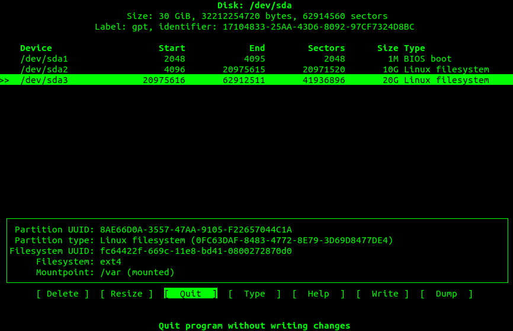
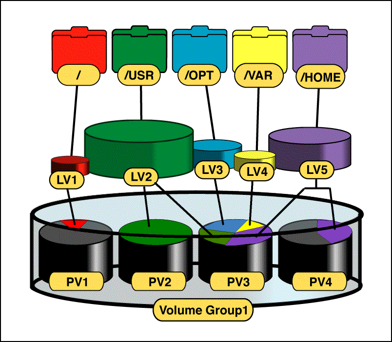
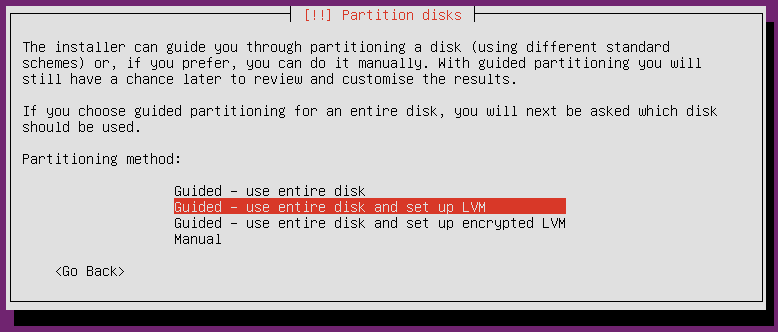

################
Disky a zařízení
################

This is an ordinary paragraph, introducing a block quote.

    "V Linuxu je je vše soubor. Pokud to není soubor, je to proces."

    -- Kamenné pravidlo souborů v Linuxu

Druhy souborů
*************

Soubor má však velmi široký význam a "běžný" soubor s textem, obrázkem ap. je jen jedním z typů
souborů, které Linux rozlišuje. Především mezi soubory zahrnujeme i `souborová zařízení`_
reprezentující různé hardwarové komponenty. Dokonce i složka je zvláštním druhem souboru, který
obsahuje seznam jiných souborů.

Přístup "vše je soubor" má velké množství výhod, které postupně objevíte sami.

Druhy souborů představíme spolu s příkazem ``ls -l``, který s tímto parametrem před oprávněním
souboru uvede jeho typ.

.. tip:: Skoro jistě můžete místo ``ls -l`` používat ``ll``. Je to tzv. alias, který provede ``ls -l``.

Např. ve výpisu domovské složky ``ls -l ~`` najdeme obyčejný soubor (``-``) a složky (``d``)::

    ...
    -rwxr-xr-x  2 libor libor    4096 Oct 25 23:40 tmp
    drwxr-xr-x  2 libor libor    4096 Oct 25 23:40 Videos
    drwxrwxr-x  4 libor libor    4096 Oct 13 10:00 VirtualBox VMs
    drwxrwxr-x  9 libor libor    4096 Oct 18 13:12 workspace
    ...

Další druhy souborů najdete v tabulce.

.. csv-table:: Druhy souborů a odpovídající symboly ve výpisu ``ls -l``.
   :header: "Symbol v ``ls -l``", "Význam"
   :widths: 25, 75
   
   "``-``", "*normální soubor* s texty, obrázky, hudbou ap."
   "``d``", "*složka (directory)* - speciální soubor obsahující názvu jiných souborů"
   "``l``", "*symbolický odkaz (link)* na jiný soubor"
   "``c``", "*znakové (character) zařízení*. Viz `bloková a znaková zařízení`_."
   "``s``", "*doménový soket (domain socket)* je podobný soketům protokolu TCP/IP. Slouží jako prostředek interprocesové komunikace (IPC)."
   "``p``", "*pojmenovaná roura (named pipe)*. Podobně jako sokety jsou prostředkem pro IPC, ale bez sémantiky síťových socketů."
   "``b``", "*blokové zařízení*. Viz `bloková a znaková zařízení`_."

Oddíly a souborové systémy
**************************

Fyzický pevný disk může být rozdělen na více *oddílů (partitions)*. Oddíly jsou na sobě nezávislé a
pád nebo chyba jednoho neovlivní druhý. OS Linux v typické instalaci používá více oddílů.

Důvod je především historický, kdy ještě nebyly používány žurnálovací *souborové systémy
(filesystems)* a problém by mohl vést až ke ztrátě dat. Ale i dnes má rozdělení na více oddílů
význam. Vytvoříte skript, který nedopatřením zaplní veškeré místo a zastaví se tím systém. Protože
skript běží na samostatném oddílu, nemůže ovlivnit oddíl s OS.

.. topic:: Žurnálovací filesystem

   Zabezpečuje data před neočekávaným výpadkem napájení nebo odpojením zařízení tím, že zapisuje
   změny nejprve do speciálního záznamu - žurnálu - a teprve pak pak skutečně na disk. Následně je
   údaj o úspěšné realizaci zaveden do žurnálu a nakonec je zrušen. Díky tomu je možné v případě
   přerušení vrátit stav na před operací nebo ji dokončit.

   Žurnálování nechrání před chybami na disku a logickými chybami. Pro ochranu tohoto druhu slouží
   RAID.

   Dnes žurnálují takřka všechny moderní filesystémy: NTFS (Win), HFS+ (Mac), všechny \*nixové FS
   jako ext3, ext4, ReiserFS, XFS, JFS, ZFS. Staričký FAT žurnálový není.

Linux obvykle ke správné činnosti využívá nejméně dva druhy oddílů:

* *datový (běžný) oddíl* naformátovaný na některý z řady podporovaných souborových systémů pro
  ukládání dat OS nebo uživatelských dat. Běžných oddílů lze mít více.

* *odkládací oddíl*, který nemá žádné naformátování (je tzv. raw). Využívá ho OS při nedostatku RAM.
  Tento princip virtuální paměti podporují dnes všechny velké OS.

.. todo:: odkaz do předchozího dílu knihy:
.. ..tip:: Více o instalaci, vhodném rozvržení disku, volbě velikosti odkládacího oddílu naleznete v <<../usrv1/02-instalace.adoc>>.

Startování z disku
******************

Master Boot Record (MBR)
========================

MBR je bootovací sektor (512 bajtů) na úplném začátku disku. MBR obsahuje

* informace o rozdělení disku na logické oddíly obsahující souborové systémy
* proveditelný kód, tzv. boot loader, který většinou jen předá řízení skutečnému spouštěči jako GRUB

GUID Partition Table (GPT)
==========================

Koncept MBR pochází z roku 1983 a je postupně nahrazován GPT. GPT tabulku najdeme u všech moderních
strojů s UEFI firmwarem (nástupce BIOSu). Z GPT můžou bootovat všechny moderní OS včetně OS X a
Windows a samozřejmě Linuxu. Hlavní linuxové nástroje pro práci z disky byly aktualizovány pro
podporu GPT.

GRUB
====

GRUB je standardní boot loader většiny linuxových distribucí. Nahradil starší LILO (LInux LOader).
Je to "to menu po startu PC s výběrem OS". Umožňuje startovat nejen Linuxy, ale i DOS, Windows, BSD
a Solaris systémy.

.. _souborova-zarizeni:

Souborová zařízení
******************

Složka ``/dev/`` obsahuje speciální soubory všech zařízeních připojených k počítači. Soubory zařízení se
vytváří v průběhu instalace nebo dodatečně skriptem ``/dev/MAKEDEV`` a ``MAKEDEV.local`` (o této variantě se
ale bavit nebudeme).

.. todo: odkaz do prvního dílu

"Vše je soubor" je doslova geniální rozhodnutí. Zařízením můžete nastavovat
<<../usrv1/06-souborova-opravneni.adoc,vlastníka, skupinu a oprávnění>>, vytvoření image oddílu se
rovná čtení souboru, vytištění poslání na zařízení tiskárny atd.

Bloková a znaková zařízení
**************************

Linux rozlišuje mezi znakovými a blokovými zařízeními. Mezi běžnější bloková zařízení patří všechna,
které umí "udržet" data jako disketa, pevný disk, USB paměť nebo disk ap.

Znaková:

* pásky, sériové linky
* nebufferovaný přímý přístup
* neznamená, že můžete číst/zapisovat jen po jednom znaku (toto rozhodnutí je na zařízení samotném)
* sekvenční přístup

Bloková:

* disky
* můžete číst/zapisovat jakýkoli blok bajtů
* bufferuje
* nevýhoda buferování je, že nevíte, že data byla už zapsána na zařízení
* náhodný přístup

Nejdůležitější zařízení v ``/dev/``
***********************************

Následující výčet není v žádném případě úplný. Seznámíme se jen s některými nejdůležitějšími
zařízeními a pochopitelně ne všechny musí být ve vašem Linuxu přítomny. Některé zařízení jsou
imaginární nebo dokonce "vtipná".

.. rubric:: ``/dev/fd[0-9]``

První disketová jednotka je fd0. Druhá fd1 ap.

.. rubric:: ``/dev/hd[a-d]``

IDE disky. hda je primary master, hdb je primary slave, hdc secondary master, hdd secondary slave.

.. rubric:: ``/dev/hd[a-d][1-9]``

Oddíly na daném IDE disku. Oddíly 1-4 jsou primární oddíly. Oddíly 5+ jsou logické oddíly uvnitř
rozšířených oddílů. Takže např. hdb1 je primární partition na primary master.

.. rubric:: ``/dev/lp[0-9]``

lp0 je první paralelní tiskárna ap.

.. rubric:: ``/dev/loop[0-9]``

Tzv. loopback zařízení jsou pseudozařízení zpřístupnění souboru jako blokového zařízení (např.
připojení .iso obrazu)

.. rubric:: ``/dev/null``

Neboli "černá díra" ve které nenávratně zmizí cokoli tam zapíšete. Užitečnost tohoto zařízení je
hlavně pro skripty, kdy do černé díry přesměrujete výstup, která vás nezajímá.

.. code-block:: shell

   # stderr výstup nás nezajímá - přesměrován do černé díry
   # stdout bude stále na konzoli
   somecommand 2> /dev/null
   

.. rubric:: /dev/psaux

Port myši PS/2.

.. rubric:: /dev/cdrom a /dev/dvd

Jsou jen linky na konkrétní konkrétní sr* zařízení.

.. rubric:: /dev/random a urandom

Generátory náhodných čísel. random je nedeterministický, což znamená, že následující číslo nelze
odhadnout z předchozích čísel. urandom je "pouze" pseudonáhodné, ale taky rychlejší. Nezáleží vám na
vysoké bezpečnosti, postačí urandom.

Chcete vytvořit umělé zatížení PC? Čtěte z urandom a posílejte ho do null.

::

   cat /dev/urandom > /dev/null

Chcete vytvořit 10 MB "náhodný" soubor (náhodného obsahu)?

::

   dd if=/dev/urandom of=random.bin bs=1M count=10

.. rubric:: /dev/sd[a-z]

Původně sd zařízení byli SCSI disky, ale toto rozhraní se nikdy výrazněji nerozšířilo a s masivním
nástupem SATA disků se vývojáři rozhodli využít tohoto zavedeného souborového zařízení pro toto
rozhraní. Písmena abecedy jsou přiřazovány, tak jsou zařízení nalezeny na sběrnici - první sda,
druhé sdb ap.

.. rubric:: ``/dev/sd[a-z][0-9]``

Určuje oddíl na sd disku. Oddíly jsou číslovány od 1. Např. sda2 je druhý oddíl na prvním SATA
disku.

.. rubric:: ``/dev/sr[0-9]``

Souborové zařízení pro CD/DVD-ROM. sr0 je první, sr1 druhé ap.

.. rubric:: ``/dev/ttyS[0-9]``

Sériový port.

.. rubric:: ``/dev/zero``

Čtení zero zařízení vrátí vždy nulu. Užitečnost je opět spíše pro skripty, kdy chcete vytvořit velký
soubor vyplnit do určité velikosti nulami.

Připojení a odpojení
********************

Před použitím se musí souborový systém připojit. Linux má plochou adresářovou strukturu. Každá
složka může být na zcela jiném oddílu. Často se to používá např. pro oddělení ``/var/`` od zbytku
systému ``/`` na serveru nebo pro umístění OS na rychlý, ale malý SSD a ``/home/`` na pomalý, ale
velký mechanický HDD.

mount
=====

Pro připojení slouží příkaz ``mount``. V základní podobě akceptuje dva parametry - soubor zařízení
na kterém leží připojovaný filesystém a složku, kam souborový systém připojit. Cílové složce se
někdy říká *přípojný bod (mount point)*.

.. important:: Cílová složka nemusí být prázdná, ale musí existovat. Případný předchozí obsah po
   připojení se neztratí, ale je zastíněn a dočasně nedostupný.

::

    # Připojení sdc5 jako /home/joe/ mount
    /dev/sdc5 /home/joe/

Linux podporuje téměř všechny myslitelné souborové systémy a pokusí se jej na zařízení rozpoznat.
Můžete ale typ určit parametrem ``-t``::

    # Explicitní určení souborového systému
    mount -t ntfs /dev/sdc5 /home/joe/

umout
=====

.. note:: Je to opravdu umount, nikoli unmount :-)

Pro odpojení slouží ``umount`` a má jediný parametr - buď soubor zařízení nebo přípojný bod
(složku)::

    # Odpojení přes zařízení
    umount /dev/sdc5

    # nebo přes přípojný bod
    umount /home/joe/

/etc/fstab
==========

Pro automatické připojení během startu OS slouží soubor /etc/fstab.

.. code-block:: text
   :caption: Příklad ``/etc/fstab`` pro desktop s rozdělením ``/`` a ``/home/`` a swap oddílem
   
   # <file system> <mount point>   <type>  <options>       <dump>  <pass>
   # / was on /dev/sdb1 during installation
   UUID=bc36b18b-274f-485e-892b-2f1b113bb34c /               ext4    errors=remount-ro 0       1
   # /home was on /dev/sda2 during installation
   UUID=ec39c1cf-e1bf-45bd-b6f2-17ce33dddc65 /home           ext4    defaults        0       2
   # swap was on /dev/sda1 during installation
   UUID=458013ba-217f-4bc5-beed-ff43f8cc5ac0 none            swap    sw              0       0

Viz ``man fstab``.

Programy pro práci s disky a oddíly
***********************************

.. caution:: Většina programů vyžaduje root oprávnění (provádějte pomocí <<../usrv1/04-uzivatele-skupiny.adoc#sudo,sudo>>).
   Bez nich nebude fungovat nebo nebude vypisovat žádné údaje.

dd
==

Program pro nízkoúrovňové binární kopírování bajt po bajtu. Vhodné pro image disku, kopii MBR
(prvních 512 bajtů) ap.

Základními parametry jsou ``if`` (input file), ``of`` (output file), ``bs`` (block size), a
``count`` (počet).

::

    # Vytvoření náhodného 10 MiB souboru
    dd if=/dev/urandom of=random.bin bs=1M count=10)

lsusb
=====

Vypíše informace o USB sběrnicích a zařízeních k nim připojených.

Důležité parametry jsou ``-t`` pro výpis ve stromu a ``-v`` pro detailní výpis.

::

    sudo lsusb -t
    /:  Bus 04.Port 1: Dev 1, Class=root_hub, Driver=ehci-pci/2p, 480M
        |__ Port 1: Dev 2, If 0, Class=Hub, Driver=hub/8p, 480M
    /:  Bus 03.Port 1: Dev 1, Class=root_hub, Driver=ehci-pci/2p, 480M
        |__ Port 1: Dev 2, If 0, Class=Hub, Driver=hub/6p, 480M
            |__ Port 3: Dev 3, If 0, Class=Vendor Specific Class, Driver=rtsx_usb, 480M
            |__ Port 4: Dev 4, If 0, Class=Wireless, Driver=btusb, 12M
            |__ Port 4: Dev 4, If 1, Class=Wireless, Driver=btusb, 12M
            |__ Port 5: Dev 5, If 0, Class=Video, Driver=uvcvideo, 480M
            |__ Port 5: Dev 5, If 1, Class=Video, Driver=uvcvideo, 480M
    /:  Bus 02.Port 1: Dev 1, Class=root_hub, Driver=xhci_hcd/4p, 5000M
    /:  Bus 01.Port 1: Dev 1, Class=root_hub, Driver=xhci_hcd/4p, 480M

lshw
====

Základní program pro výpis informací o hardwaru. Může zjistit údaje o přesné konfiguraci paměti,
obsazených bankách, firmwaru, CPU ap.

Bez parametrů vypíše všechny známé údaje. Kategorii omezíte parametrem ``-C, -class`` např. na
sítě::

    sudo lshw -class network

Dostupné třídy (kategorie) zjistíte ve výpisu ``sudo lshw -short``.

lsof
====

Vypisuje na STDOUT informace o souborech otevřených procesem.

Bez parametrů vytvoří velmi dlouhý výstup otevřených souborů všech aktivních procesů. Mezi velkým
množstvím parametrů zmíníme jen -i pro zjištění jaký proces okupuje síťový port.

::

    $ lsof -i:45981
    COMMAND     PID USER   FD   TYPE  DEVICE SIZE/OFF NODE NAME
    gvfsd-htt 32452 jell  432u  IPv4 2534209      0t0  TCP jell-nb:45981->myapps.developer.ubuntu.com:http (CLOSE_WAIT)

fdisk
=====

Program stejného jména z MS-DOSu existuje i pro Linux, ale jeho ovládání je založeno na parametrech
příkazové řádky.

Protože je to nízkoúrovňový program a ukážeme si modernější alternativy, naučíme se jen vypsat
seznam disků a oddílů na nich::

    sudo fdisk -l

cfdisk
======

Snadnější a modernější alternativou je cfdisk, který přípomíná ovládáním fdisk z MS-DOSu.

.. caution:: Je třeba program spustit s parametrem určujicím nad jakým zařízením chceme pracovat.

::

    sudo cfdisk /dev/sda

parted a gparted
================

Textový parted a grafický GParted jsou lepší pokročilejší zástupci programů pro správu disků a
oddílů. GParted připomíná komerčním Partition Magic.

Logical Volume Management (LVM)
*******************************

.. todo: odkaz do I
.. important:: Úvod a výhody LVM místo tradičního rozvržení disku najdete v
   "../usrv1/02-instalace.adoc#lvm,kapitole o instalaci".

LVM je alternativním a moderní způsob správy disků v Linuxu. Všechny současné distribuce a nástroje
LVM podporují. Často je to dokonce výchozí volba instalátoru jako v Ubuntu.

.. caution:: Současná verze o které budeme dále hovořit je LVM 2. Starším se vyhýbejte.

Terminilogie LVM
================

LVM používá několik klíčových termínů, které musíme vysvětlit:

* *Volume group (skupina svazků) (VG)* sdružuje LV a PV do jedné administrativní jednotky. Je to
  nejvyšší úroveň členění v LVM. Můžeme ji pojmenovat např. podle počítače nebo "dpt1" ap.

  * VG můžou být zvětšena/zmenšena přidáním/odebráním nových PV

* *Physical volume (fyzický svazek) (PV)* je obvykle odpovídá fyzickému zařízení pevného disku, ale
  může se jednat jen o "pohled" na disk třeba v případě softwarového RAIDu.

  * každý PV je rozdělen do úseků dat známých jako physical extent (PE) o stejné velikosti jako LE.

* *Logical Volume (logický svazek) (LV)* je ekvivalent diskového oddílu v ne-LVM systému.
  LV je viditelný jako běžné blokové zařízení a obsahuje samotný souborový systém.

  * každý LV je rozdělen do úseků dat známých jako logical extent (LE) ve velikosti stejné pro
    všechny LV ve VG.
  * LV můžou být zvětšena/zmenšena spojením/rozpojením nových extents
  * LV můžou být přemístěny mezi PV
  * na rozdíl od tradičních oddílů mají jména místo čísel, můžou se rozkládat napříč více
    PV (disky), které nemusí být ani fyzicky v řadě

   Organizace prvků LVM (obrázek převzat z http://www.markus-gattol.name/ws/lvm.html)

Pokud vás ani toto nepřesvědčilo, tak přidáváme, že všechny operace jsou online, tj. plně "zaživa"
bez umount, zastavení a restartu stroje.

Jak začít použít LVM
=====================

Instalátor Ubuntu (Server) podporuje a dokonce jako výchozí nabízí rozvržení disku pomocí LVM. Tento
způsob "jak na LVM" je doporučený a nejsnadnější.

Praktický příklad použití LVM
=============================

Nástroje pro LVM tvoří sada programů pojmenovaných vg*, pv* a lv* (jako volume group, physical
volume a logical volume) + sloveso jako create, display, remove ap.

Ve výchozí instalaci LVM nástroje chybí a musíte je doinstalovat příkazem ``sudo apt-get install
lvm2``.

.. code-block:: shell

   # 2 disky při instalaci jeden jako LVM. Oba třeba 8 GB.

   # druhý není nijak naformátovaný

   sudo fdisk -l

   # Jestli chci využít celý disk tak jak leží běží pro LVM, pak v příkazu pvcreate pište jen /dev/sdb a tento krok není nutný
   sudo cfdisk /dev/sdb
   # a vytvořte jeden Linux LVM (8e) oddíl plné velikosti disku

   # Zapíše do parittion LVM hlavičku
   sudo pvcreate /dev/sdb1

   # Zobrazí physical volumes
   sudo pvdisplay
   # nebo
   sudo pvs

   # Vytvoří volume group ze zařízení
   sudo vgcreate vg0 /dev/sdb1
   # (lze zadat i více zařízeních)

   # Zobrazí volume groups
   sudo vgdisplay
   # pozor, že "vgs" neexistuje

   # Vytvoření logical volumes
   # -n = jméno, -L = velikost vg0 = ze které volume group
   sudo lvcreate -n g0_root -L 2g vg0
   sudo lvcreate -n g0_home -L 2g vg0
   sudo lvcreate -n g0_var -L 2g vg0

   # Zobrazíme a uvidíme /dev/myvg1/logicka1
   sudo lvdisplay
   # nebo
   sudo lvs

   # Naformátování logickéhých svazků na ext4
   sudo mkfs.ext4 /dev/vg0/g0_root -L root
   sudo mkfs.ext4 /dev/vg0/g0_home -L home
   sudo mkfs.ext4 /dev/vg0/g0_var -L var

   # Rozšíření o 1 GiB
   sudo lvresize -L +1G vg0/g0_root
   # příkazu můžete doplnit na konec PV ze kterých má být "ukrojeno", jinak se použije místo kdekoli v jakékoli PV v rámci VG

   # Přesvěčte se výpisem logical volumes
   sudo lvdisplay

   # Je třeba rozšířit i filesystem na novou velikost (pro ext4):
   sudo resize2fs /dev/vg0/g0_root

   # Připojte oddíly
   sudo mkdir /mnt/g0_root
   sudo mount /dev/vg0/g0_root /mnt/g0_root

   # Přesvěčte se
   df -h

.. tip:: Výmaz VG - Umí vymazat VG a s ní všechny LV. LV musí být umountovány.

.. tip:: Zvětšení oddílu i filesystemu v jednom kroku -  lvresize má od vyšší verze LVM2
   volbu -r, kdy zvětší i filesystem, takže nemusíme následně volat resize2fs.