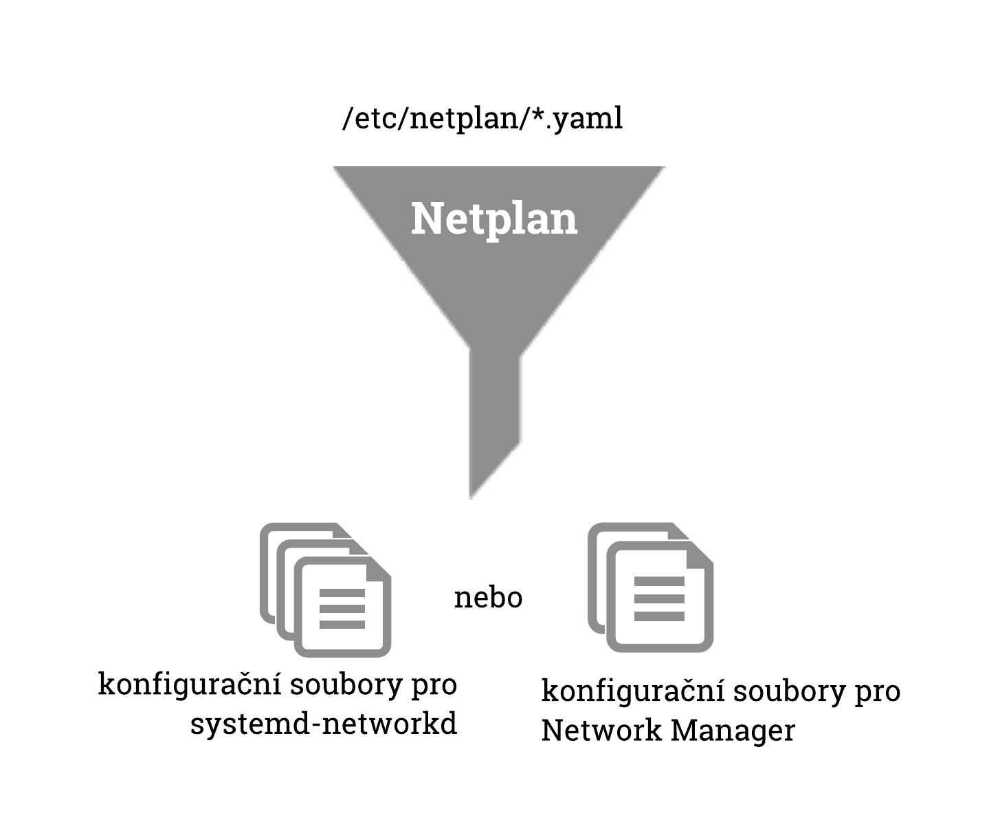

Konfigurace sítí v Linuxu
#########################

Už před léty s příchodem :ref:`systemd <systemd>` došlo k poměrně hlubokým změnám v konfiguraci sítí
v Linuxu: překlad jmen zajišťuje systemd-resolved (nebo prostě jen resolved), síťová rozhraní na
serverech spravuje systemd-networkd (nebo prostě jen networkd), na desktopech obvykle Network
Manger (NM) atd.

Tyto změny přináší výhody pro složité systémy s mnoha síťovými adaptéry, systémy běžící v cloudu,
minipočítače pro IoT atd. Bohužel taky komplikují nastavení sítě a banální požadavek "chci jen
nastavit IP, masku, bránu, DNS" je doslova věda. Kde jsou doby, kdy stačilo upravit soubor ``/etc/network/interfaces``...

Ubuntu 18.04 obsahuje další změny v tradiční správě sítí v podobě správce `Netplan`_, který
nahrazuje `ifupdown`_ (soubor ``/etc/network/interfaces``). Motivací k dalšímu řešení je
zjednodušení poměrně velké náročnosti konfigurace a různá konfigurace stejných věcí v networkd a
Network Manageru.

V této kapitole se pokusíme vysvětlit všechny způsoby, abyste byli schopni administrovat nové i
staré instalace Ubuntu.

Síťová rozhraní
***************

Síťová rozhraní či síťové adaptéry jsou :ref:`souborová zařízení <souborova-zarizeni>` ve složce
``/dev/``. Můžete se setkat se dvěma způsoby pojmenovávání síťových rozhraní.

.. rubric:: Tradiční pojmenování

Velice dlouhou dobu to bylo jediné pojmenování síťových rozhraní. Toto jednoduché schéma je podobné
ostatním :ref:`souborovým zařízením <souborova-zarizeni>`. Např. pro kabelově vedený ethernet se
adaptéry jmenují jako ``eth0``, ``eth1``, ap. tak jsou nacházena ovladačem.

Název se řídí typem adaptéru:

* ``eth0``, ``eth1``, ... -- klasický kabelově vedený ethernet. První rozhraní je ``eth0`` atd.
* ``lo`` -- loopback zařízení. Je speciální síťové rozhraní, které je vždy přítomné i na počítači
  bez skutečné síťové karty. Slouží k provozu síťových aplikací i bez nutnosti "jít" na skutečnou
  síť. Má přiřazenou pevnou IP adresu 127.0.0.1.
* ``wlan0``, ``wlan1``, ... -- bezdrátové Wi-Fi karty jsou označeny wlan (wireless LAN). První
  rozhraní je ``wlan0`` ap.

Tento způsob pojmenování má nevýhodu v tom, že není zcela spolehlivý. Může se např. stát, že při
změně hardware dojde k záměně - adaptér je ``eth0`` je při jednom startu, ``eth1`` při dalším.

.. rubric:: Pojmenování rozhraní v systemd

S příchodem :ref:`systemd <init-systemy>` se změnilo v linuxových systém mnoho - i schéma
přidělování jmen síťových rozhraní zvané `Predictable Network Interface Names
<https://www.freedesktop.org/wiki/Software/systemd/PredictableNetworkInterfaceNames/>`_
(predikovatelná jména síťových rozhraní). Místo tradičním jmen jako ``eth0`` se setkáte s názvy
``enp5s0`` ap., která jsou stabilní (predikovatelná), protože se tvoří na základě údajů jako číslo
přečtené z firmwaru nebo BIOSu, číslem PCI sběrnice do které je karta vložena, fyzickým umístění ap.

Konkrétní postup tvorby jména je poměrně složitý a najdete zdokumentován ve `zdrojových kódem
systemd <https://github.com/systemd/systemd/blob/master/src/udev/udev-builtin-net_id.c>`_. Např.
název rozhraní ``enp0s3`` se vytvoří nějak takto:

* první dvě písmena (``en``) -- typ rozhraní: např. ``en`` pro ethernet, ``wl`` pro wireless
  LAN (Wi-Fi)
* třetí písmeno a číslo (``p0``) -- typ připojení a pořadí: např. ``p`` připojeno nultou PCI
  sběrnicí
* poslední písměno a číslo (``s3``) -- číslo slotu: např. třetí slot na nulté PCI sběrnici.

.. topic:: Speciální IP adresy

   Kromě IP adresy přiřazené administrátorem nebo DHCP systémem se používá několik speciální IP
   adres s pevným významem, které si nemůžeme zvolit pro síťové rozhraní:

   * ``0.0.0.0`` (IPv4)/``::`` (IPv6) — všechna síťová rozhraní počítače
   * ``127.0.0.1`` (IPv4)/``::1`` (IPv6) — loopback rozhraní (``/dev/lo``) (hostname ``localhost``)

Netplan
*******

Ubuntu 18.04 přináší další změny v tradiční správě sítí v podobě manažeru `Netplan`_, který
nahrazuje `ifupdown`_ (soubor ``/etc/network/interfaces``). Poprvé se Netplan objevil v Ubuntu 17.10
a motivací k novému řešení je zjednodušení poměrně velké náročnosti konfigurace a různá konfigurace
stejných věcí v systemd-networkd (na serveru) a Network Manageru (na desktopu).

Jak Netplan pracuje
===================

Netplan pracuje tak, že pomocí YAML souborů popíšete libovolně jednoduchou nebo složitou síťovou
konfiguraci ze které Netplan vygeneruje konfiguraci pro zvolený *renderer* - buď networkd (výchozí)
nebo Network Manager. Podstatně tím zjednodušuje naši práci, protože zejm. v networkd může znamenat
jednoduchá změna nastavování až ve třech různých souborech (!).

.. note:: "Skryváním" komplexity je Netplan podobný :ref:`UFW`, jinému nástroji z Ubuntu pro správu
   firewallu.

Netplan očekává konfiguraci v ``/etc/netplan/*.yaml`` souborech. Můžete je zde vytvářet správce, ale
často balíčky a podobné nástroje. Během startu počítače Netplan vygeneruje příslušné konfigurační
soubory v ``/run/``. Pokud není v YAML souboru jinak, vytváří konfiguraci pro systemd-networkd.

Všechny nalezené YAML soubory se seřadí. Klíče nalezené v souborech později v abecedě můžou přepsat
klíče ze souborů dříve v abecedě, nebo vytvořit nové klíče. Právě z tohoto důvodu se setkáte soubory
pojmenovanými jako ``50-cloud-init.yaml``.

Konfigurace Netplan
===================

Netplan používá jednoduchý textový formát YAML. Soubory s příponou ``.yaml`` hledá ve složce
``/etc/netplan/``, které vypadají např. takto:

.. code-block:: yaml

   network:
     version: 2
     ethernets:
       eno1:
         dhcp4: true

YAML dokument začíná klíčem ``network``, následuje ``version: 2`` (v tuto chvíly
aktuální verze konfiguračního souboru) a konfiguracemi zařízeních seskupené podle typu jako např.
``ethernets`` a ``wifis``. Pod blokem typu zařízení je název síťového zařízení a jeho konfigurace.

.. csv-table:: Nejdůležitější vlastnosti společné pro všechny typy zařízení.
   :header: "Klíč", "Hodnota", "Význam"
   :widths: 20, 30, 50

   "``renderer``", "``networkd`` (výchozí) nebo ``NetworkManager``", "Pro jaký síťový systém vygenerovat konfiguraci."
   "``dhcp4``", "``true``/``false`` (výchozí)", "Podpora DHCP pro IPv4."
   "``dhcp6``", "``true``/``false`` (výchozí)", "Podpora DHCP pro IPv6."
   "``addresses``", "seznam IP adres", "Pevná IP adresa nebo adresy zařízení vč. síťové masky v CIDR notaci. Např. ``addresses: [192.168.14.2/24, ""2001:1::1/64""]``."
   "``gateway4`` a ``gateway6``", "seznam IP adres", "IPv4/IPv6 výchozí brána. Vyžadováno, pokud je uvedeno ``addresses``. Např. ``gateway4: 172.16.0.1`` nebo ``gateway6: ""2001:4::1""``"
   "``nameservers``", "mapování s klíči ``addresses`` a ``search``", "Nastavení DNS serverů a domén.
   Hodnotou je mapování s klíčem ``addresses`` pro seznam IPv4 nebo IPv6 adres) a ``search``
   pro seznam vyhledávaných domén). Např.::

        nameservers:
            search: [vacademy.net, vacademy.cz]
            addresses: [8.8.8.8, ""FEDC::1""]
   "

Netplan má řadu dalších možností - např. nastavení routovacích tabulek, bondovací a bridgeování
zařízení, určení zařízení pomocí wildcard výrazů jako ``enp2*`` (všechny karty na druhé PCI
směrnici) ap. Kompletní seznam konfigurace najdete v ``man netplan``.

Dvě nejčastější možnosti nastavení sítě - manuální a DHCP - si ukážeme na příkladech.

.. code-block:: yaml
   :caption: Příklad nastavení přes DHCP

   network:
     version: 2
     ethernets:
       enp0s3:
         dhcp4: true

.. code-block:: yaml
   :caption: Příklad manuálního nastavení

   network:
     version: 2
     ethernets:
       enp0s3:
         addresses: [192.168.1.115/24]
         gateway4: 192.168.1.1
         nameservers:
           search: [mycompany.local, myorg.local]
           addresses: [8.8.8.8, 192.168.1.2]o

Netplan příkazy
===============

Ovládání Netplanu je velmi jednoduché. V podstatě jde jen o dva podpříkazy v podobě ``netplan <podpříkaz>``.

.. rubric:: ``netplan apply``

Vygeneruje z YAML souborů konfiguraci pro zvolený renderer (defaultně systemd-networkd) a aplikuje
změny (restartuje renderer). Např. pro výše uvedený příklad manuálního nastavení se vytvoří soubor
``/run/systemd/network/10-netplan-enp0s8.network`` s tímto obsahem::

    [Match]
    Name=enp0s8

    [Network]
    Address=192.168.88.115/24
    Gateway=192.168.1.1
    DNS=192.168.88.1
    DNS=8.8.8.8
    Domains=mycompany.local myorg.local

.. rubric:: ``netplan generate``

Jen vygeneruje konfiguraci pro renderer, neaplikuje změny.

.. systemd-networkd
   ****************

   http://manpages.ubuntu.com/manpages/bionic/man5/systemd.network.5.html

   systemd-networkd
   * man systemd-networkd
   * ovládání programem "networkctl" např. "networkctl status enp0s3"

   systemd-resolved
   ****************

   Od Ubuntu 16.04 je výchozím překladačem pro DNS systemd-resolved.

ifupdown
********

Ubuntu 16.04 nahradilo tradiční konfiguraci sítí souborem ``/etc/network/interfaces`` novým
manažerem `Netplan`_. Balíček ifupdown již není součástí instalace a proto ani programy ``ifup``,
``ifdown`` a ``ifquery``.

.. important:: V Ubuntu 18.04 se můžete vrátit k dřívější konfiguraci sítě, tak
   že nainstalujete balíček ``ifupdown`` a nastavíte ``/etc/network/interfaces`` manuálně jako
   dříve. **Pokud nejste na starém systému nebo nemáte jiný závažný důvod, doporučujeme však již
   nepoužívat ifupdown.**

   Další možností je vynutit si ifupdown volbou ``netcfg/do_not_use_netplan=true`` během instalace,
   tak že na první obrazovce instalátoru stisknete :kbd:`F6`, pak :kbd:`e` a tuto volbu přidáte do
   příkazové řádky.

.. _etc_network_interfaces:

``/etc/network/interfaces``
===========================

Hlavní konfiguračním souborem sítí v Debianu a Ubuntu byl dlouhou dobu ``/etc/network/interfaces``
s informace pro nástroje ``ifup`` a ``ifdown``.

.. important:: Pokud jste na Netplan systému v souboru najdete upozornění, že *ifupdown has been
   replaced by netplan(5) on this system* (ifupdown byl na tomto systému nahražen netplan) a tohoto
   souboru si nevšímejte.

Konfigurační soubor ``interfaces`` obsahuje informace, jak se připojit k síti. Na rozdíl od později
probíraných programů jako `ifconfig`_ je nastavení v souboru přečteno při startu počítače a tedy
trvalé.

Pokud používáte v síti DHCP není třeba vůbec žádné nastavení a váš soubor ``interfaces`` obsahuje
jen dva řádky pro zapnutí (``auto``) a nastavení ``iface`` loopback zařízení::

  auto lo
  iface lo inet loopback

Povely ``auto``, ``iface`` a další nazývá dokumentace jako *stanzas*. Konfigurace je velmi rozsáhlá
a proto pro pokročilejší nastavení odkazujeme na ``man 5 interfaces``. Ukážeme si proto jen další
typický setup se statickou IP adresou bez DHCP::

  auto eth0
  iface eth0 inet static
          address 192.168.1.1
          netmask 255.255.255.0
          gateway 192.168.1.50
          dns-nameservers 192.168.1.50

Potřebujete-li nastavit sekundární, terciární, ... DNS, pak do předchozího řádku přidejte mezerou
oddělení jejich IP adresy::

  dns-nameservers 192.168.1.50 192.168.1.51

.. todo:: "restart počítače" odkaz do I.

Pro aplikaci nastavení je třeba provést restart sítě nebo restart počítače.

.. _ifconfig_konfigurace:

ifconfig
========

.. note:: V DOSu a Windows je podobný program nazván ipconfig.

Ifconfig neboli interface configuration je nejznámější nástroj pro konfiguraci a diagnostiku sítí.
Ipconfig slouží k nastavení síťových zařízení a jako takový neumí nastavit bránu (gateway) nebo DNS.

.. caution:: Veškeré změny provedené ifconfigem "nepřežijí" restart. Pro trvalé změny musíte
   rozhraní nastavit konfigurací systémů `Netplan`_ nebo `ifupdown`_.

Informace o zařízeních
----------------------

Bez parametrů vypíše základní informace o aktivních síťových rozhraních. S parametrem ``-a`` (all) i
o těch neaktivních. ``-s`` (short) slouží ke stručnému výpisu.

::

    $ sudo ifconfig -a -s
    Iface      MTU    RX-OK RX-ERR RX-DRP RX-OVR    TX-OK TX-ERR TX-DRP TX-OVR Flg
    enp0s3    1500    93652      0      0 0         46177      0      0      0 BMRU
    enp0s8    1500        0      0      0 0             0      0      0      0 BM
    lo       65536      231      0      0 0           231      0      0      0 LRU

Povolení/zakázání rozhraní
--------------------------

Povolení::

    sudo ifconfig <rozhraní> up

Zakázání::

    sudo ifconfig <rozhraní> down

Přiřazení IP adresy a masky podsítě
-----------------------------------

Přiřazení IP::

    sudo ifconfig <rozhraní> <ip>

Přiřazení IP a masky::

  sudo ifconfig <rozhraní> <ip> netmask <maska>

Pro ověření nového nastavení si můžete zkontrolovat přes ``ifconfig <rozhraní>``.

.. _ifconfig-promisc:

Povolení/zakázání promiskuitního režimu
---------------------------------------

Povolení promiskuitního režimu::

    sudo ifconfig <rozhraní> promisc

Zakázání promiskuitního režimu::

  sudo ifconfig <rozhraní> -promisc

Změna MAC adresy
----------------

Inconfig dokonce umožňuje nastavit MAC adresu rozhraní, např.::

  sudo ifconfig enp0s8 hw ether AA:BB:CC:DD:EE:FF

.. note:: Další pokročilejší nastavení jako duplex režim, wake-on-LAN můžete spravovat nástrojem
   ``ethtool`` (nemusí být součástí instalace).

.. Restart sítě
   ============

   Po změně síťové konfigurace (např. po změně z pevné IP na DHCP) je není nutné restartovat celý
   počítač. Postačí jen restart síťového subsystému.

   Zastaralou možností, která např. v Ubuntu 18.04 již neexistuje, bylo restartování :ref:`init.d
   skriptu <sysv_init>` ``networking``::

       sudo /etc/init.d/networking stop
       sudo /etc/init.d/networking start

   Tyto skripty používají příkazy ifup (zapnutí) a ifdown (vypnutí) všech rozhraních. Pokud potřebujete
   restart jen určitého rozhraní, můžete je použít na přímo::

     sudo ifdown eth0
     sudo ifup eht0

.. _routovaci-tabulky:

Routovací tabulky
*****************

Routovací (nebo též směrovací) tabulky můžete vypsat a modifikovat příkazem ``route``.

.. important:: Změny nastavené příkazem ``route`` nepřežije restart. Pro trvalé změny je třeba
   provést nastavení routovacích tabulek v `Netplan`_ souborech.

.. rubric:: Nastavení výchozí brány

Výchozí brána (default gateway) se nenastavuje na rozhraní, ale v routovacích tabulkách jádra.
Používáme proto příkaz ``route``.

::

    sudo route add default gw 192.168.123.1 enp0s8

.. rubric:: Výpis routovací tabulky

Pro ověření můžete vypsat tabulku pomocí ``route -n``::

    $ route -n
    Kernel IP routing table
    Destination     Gateway         Genmask         Flags Metric Ref    Use Iface
    0.0.0.0         192.168.88.1    0.0.0.0         UG    0      0        0 enp0s8
    0.0.0.0         192.168.88.1    0.0.0.0         UG    100    0        0 enp0s3
    192.168.88.0    0.0.0.0         255.255.255.0   U     0      0        0 enp0s8
    192.168.88.0    0.0.0.0         255.255.255.0   U     0      0        0 enp0s3
    192.168.88.1    0.0.0.0         255.255.255.255 UH    100    0        0 enp0s3

.. tip:: Routovací tabulku dokáže vypsat také ``netstat -r`` (viz :ref:`netstat`).

Hostname (jméno počítače)
*************************

.. important:: Změna přes ``hostname`` je opět platná dokud nerestartujete počítač. Pro trvalou
   změnu napište jméno do souboru ``/etc/hostname``, který je čten startovacími skripty.

.. note:: Jméno počítače nemá prakticky žádný vliv. Pokud nemáte centrální správu jmen (DNS) ostatní
   stanice vámi zvolený hostname neznají a mohou se na vás odkazovat pouze číselnou IP adresou.

Zjištění aktuálního jména počítače::

    $ hostname
    tristar

Nastavení nového jména počítače::

    $ sudo hostname bomber
    $ hostname
    bomber

Soubory ``/etc/hosts`` a ``/etc/services``
******************************************

Soubor ``/etc/hosts`` je textovým souborem do kterého se Linux podívá jako prvního, jestliže má
přeložit (resolve) jmenný název (hostname) na IP adresu (např. vacademy.cz na 210.102.2.189). IP
mohou být jak místní, tak platné z internetu.

Protože tento soubor se prohledává ještě před dotazem na nastavený DNS server je to vhodné místo pro
"zfalšování" adresy hostname serveru na kterém má běžet aplikace, kterou ještě není hotová ap..
Všechny odkazy a dotazy na např. www.mujserver.cz, tak můžete přesměrovat na 127.0.0.1 (místní
počítač).

IP adresa je od DNS jména nebo jmen oddělena jedním tabelátorem. Na jednom řádku můžete pro stejnou
IP vypsat více jmen.

.. code-block:: text
   :caption: Příklad ``/etc/hosts``

   127.0.0.1       localhost nb-mujnb www.vacademy.cz.local
   192.168.0.100   fileserver
   
   # The following lines are desirable for IPv6 capable hosts
   ::1     ip6-localhost ip6-loopback
   fe00::0 ip6-localnet
   ff00::0 ip6-mcastprefix
   ff02::1 ip6-allnodes
   ff02::2 ip6-allrouters

``/etc/services`` má podobný účel, ale slouží k "překladu" služeb (protokolů) na čísla portů.
Používá ho řada programů, aby zobrazovala např. místo 22 symbolický název "ssh".

.. code-block:: text
   :caption: Příklad ``/etc/services``

   tcpmux          1/tcp                           # TCP port service multiplexer
   echo            7/tcp
   echo            7/udp
   discard         9/tcp           sink null
   discard         9/udp           sink null
   systat          11/tcp          users
   daytime         13/tcp
   daytime         13/udp
   netstat         15/tcp
   qotd            17/tcp          quote
   msp             18/tcp                          # message send protocol
   msp             18/udp
   chargen         19/tcp          ttytst source
   chargen         19/udp          ttytst source
   ftp-data        20/tcp
   ftp             21/tcp
   fsp             21/udp          fspd
   ssh             22/tcp                          # SSH Remote Login Protocol
   ssh             22/udp

Více informací o souboru naleznete v ``man 5 services``.
