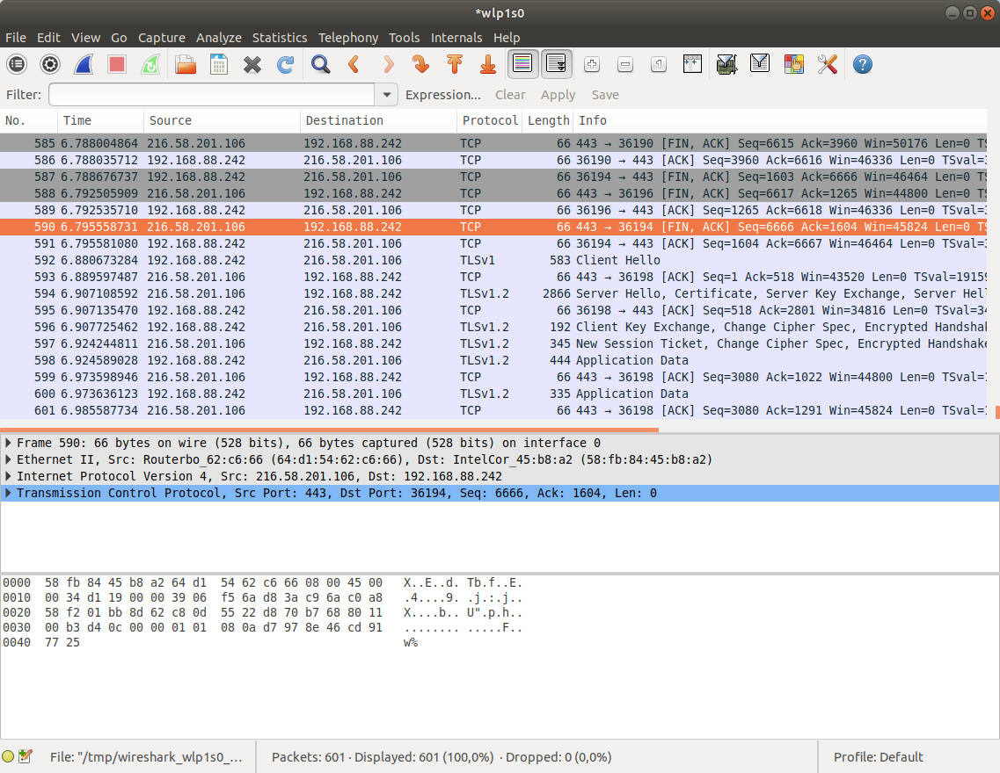

###############
Síťové nástroje
###############

****************
Diagnostika sítí
****************

.. todo: networkctl status

.. _ifconfig-diagnostika:

ifconfig
========

.. todo: že zde jen čteme informace, kdežto v :ref:`ifconfig_konfigurace` nastavujeme.

.. todo: ip - vztah k ifconfigu, místo "ifconfig" spíše "ip addr"
         vztah k "networkctl status enp0s3"

.. ifconfig bez -a zobrazuje jen aktivní rozhraní
   volba -s pro stručný výpis

Ifconfig je základní program pro diagnostiku. Bez parametrů nebo se jménem adaptéru vypíše informace
o síťových rozhraních.

::

    $ ifconfig eth0
    eth0      Link encap:Ethernet  HWaddr e0:db:55:a8:d7:0a
            inet addr:192.168.123.102  Bcast:192.168.123.255  Mask:255.255.255.0
            inet6 addr: fe80::e2db:55ff:fea8:d70a/64 Scope:Link
            UP BROADCAST RUNNING MULTICAST  MTU:1500  Metric:1
            RX packets:436 errors:0 dropped:0 overruns:0 frame:0
            TX packets:518 errors:0 dropped:0 overruns:0 carrier:0
            collisions:0 txqueuelen:1000
            RX bytes:363793 (363.7 KB)  TX bytes:82767 (82.7 KB)
            Interrupt:17

.. caution:: Dejte si pozor, že se mohou lišit výsledky ifconfigu bez sudo a se sudo.

Další použití naleznete v kapitole :doc:`konfigurace-siti`.

lshw -class network
===================

Pro nás již známý program lshw s parametrem ``-class network`` vypíše detailnější údaje o síťových
rozhraních jako chipset, sběrnici ap.

ping / ping6
============

Elementární program ping (resp. ping6 pro IPv6) pro zjišťování síťového stavu cíle. Využívá ICMP
výzvy nad protokolem UDP. Není vhodný proto náročnější služby fungující nad TCP jako HTTP, SSH ap.

Na rozdíl od Windows ping provádí ICMP ECHO_REQUEST dokud není zastaven pomocí :kbd:`Ctrl-C`.

.. todo:: link na SUID v I.

Vyžaduje root oprávnění, ale má nastaven SUID, takže ho mohou spouštět všichni uživatelé.

::

    $ ping vacademy.cz
    PING vacademy.cz (95.85.61.132) 56(84) bytes of data.
    64 bytes from 95.85.61.132: icmp_seq=1 ttl=53 time=24.5 ms
    64 bytes from 95.85.61.132: icmp_seq=2 ttl=53 time=23.1 ms
    64 bytes from 95.85.61.132: icmp_seq=3 ttl=53 time=23.1 ms
    ^C
    --- vacademy.cz ping statistics ---
    3 packets transmitted, 3 received, 0% packet loss, time 2001ms
    rtt min/avg/max/mdev = 23.101/23.607/24.524/0.672 ms

tracepath / tracepath6
======================

Ke zjištění trasy k cíli přes všechny brány slouží dvoje tracepath / tracepath6 (pro IPv6). Využívá
ICMP nad UDP a proto se nehodí k diagnostice hostitelů se zákazem UDP.

::

    $ tracepath6 3ffe:2400:0:109::2
    1?: [LOCALHOST]                         pmtu 1500
    1:  dust.inr.ac.com                     0.411ms
    2:  dust.inr.ac.com        asymm  1     0.390ms pmtu 1480
    2:  3ffe:2400:0:109::2                  463.514ms reached
        Resume: pmtu 1480 hops 2 back 2

traceroute / traceroute6
========================

Pokročilejší varianta sledování trasy, než tracepath / tracepath6, která dovede posílat nejen UDP,
ale i TCP SYN.

Některé verze Ubuntu mají pouze traceroute6 pro IPv6. Starší verze Ubuntu neobsahují tento program
vůbec. Variantu pro IPv4 si případně doinstalujte pomocí sudo apt-get install traceroute.

.. csv-table:: Porovnání tracepath a traceroute
   :header: "", "tracepath", "traceroute"
   :stub-columns: 1

   "nainstalován defaultně", "ano", "většinou ne"
   "vyžaduje root oprávnění", "ne", "ne pro UDP"
   "využívá protokoly", "UDP", "ICMP ECHO, UDP nebo TCP SYN"

Důležité pararametry:

* ``-U, --udp`` pro zjišťování pomocí UDP paketů jako `tracepath / tracepath6`_ (nevyžadují root)
* ``-I, --icmp`` pro zjišťování pomocí ICMP ECHO (vyžadují root v závislosti na verzi jádra)
* ``-T, --tcp`` nebo tcptraceroute pro zjišťování pomocí TCP SYN paketů (vyžadují root)
* ``-p, --port`` upřesní port pro TCP probes (defaultně 80)

Bez parametrů použije UDP a tedy nevyžaduje root.

::

    $ sudo traceroute --tcp virtage.com
    traceroute to virtage.com (55.15.62.72), 30 hops max, 60 byte packets
    1  12.68.323.8 (192.168.123.1)  0.403 ms  0.411 ms  0.471 ms
    2  20.18.60.1 (10.5.60.1)  32.804 ms  33.770 ms  33.760 ms
    3  20.18.214.91 (10.5.224.41)  33.751 ms  34.319 ms  34.297 ms
    4  20.18.214.19 (10.5.224.29)  34.667 ms  35.213 ms  37.564 ms
    5  63-188-70-118.foo.com (118.45.28.16)  38.136 ms  38.117 ms  38.121 ms
    6  * * *
    9  55.15.62.72 (55.15.62.72)  56.568 ms  54.614 ms  54.652 ms

.. _netstat:

netstat
=======

Netstat je program pro získání informací o síťových spojeních, routovací tabulky, maškarád a
statistik. Nejčastější využití pro výpis spojení zobrazuje TCP, UDP spoje i Unixové doménové sokety.

.. note:: Pro některé parametry např. ``-p`` je třeba třeba root oprávnění, proto je vhodnější se
   naučit používat netstat se sudo.

Představíme nejdůležitější parametry:

* ``-a, --all`` — naslouchající i nenaslouchající sokety
* ``-t, --tcp`` a ``-u, --udp`` — jen TCP nebo UDP spojení
* ``--route, -r`` — zobraz routovací tabulku
* ``-p, --program`` — zobraz PID a jméno programu využívající socket
* ``-e, --program`` — pro proces využívající socket zobraz i jeho uživatele
* ``-n, --numberic`` — zobrazuj všechny údaje číselně místo jména (rychlejší, IP místo hostname,
  port místo protokolu, UID místo username ap.)

Parametry můžete samozřejmě kombinovat. Nejčastější parametry jsou ``netstat -etupan``
(číselné vyjádření) nebo ``-etupa`` (jména místo čísel).

.. code-block:: text
   :caption: Příklad výstupu ``netstat -etupan`` (zkráceno)

   $ sudo netstat -etupan
   Active Internet connections (servers and established)
   Proto Recv-Q Send-Q Local Address           Foreign Address         State       User       Inode       PID/Program name
   tcp        0      0 127.0.0.1:5984          0.0.0.0:*               LISTEN      116        14760       1010/beam.smp
   tcp        0      0 127.0.0.1:42820         0.0.0.0:*               LISTEN      1000       1044896     8960/GoogleTalkPlug
   tcp        0      0 0.0.0.0:25162           0.0.0.0:*               LISTEN      1000       946264      4708/skype
   tcp        0      0 0.0.0.0:139             0.0.0.0:*               LISTEN      0          13154       859/smbd
   tcp        0      0 127.0.0.1:34860         0.0.0.0:*               LISTEN      1000       1044897     8960/GoogleTalkPlug
   tcp        0      0 127.0.0.1:63342         0.0.0.0:*               LISTEN      1000       2312763     19221/java
   tcp        0      0 127.0.1.1:53            0.0.0.0:*               LISTEN      0          17478       1747/dnsmasq
   tcp        0      0 127.0.0.1:631           0.0.0.0:*               LISTEN      0          2475821     26903/cupsd
   tcp        0      0 0.0.0.0:37565           0.0.0.0:*               LISTEN      1000       2315432     19221/java
   tcp        0      0 0.0.0.0:8445            0.0.0.0:*               LISTEN      1000       437603      21425/CopyAgent
   tcp        0      0 0.0.0.0:445             0.0.0.0:*               LISTEN      0          13153       859/smbd
   tcp        0      0 127.0.0.1:6942          0.0.0.0:*               LISTEN      1000       2311796     19221/java
   tcp        1      0 192.168.123.104:45708   162.213.33.242:80       CLOSE_WAIT  1000       2532339     32452/gvfsd-http
   tcp        1      0 192.168.123.104:46320   162.213.33.242:80       CLOSE_WAIT  1000       2538817     32452/gvfsd-http
   tcp        1      0 192.168.123.104:42718   162.213.33.241:80       CLOSE_WAIT  1000       2537635     32452/gvfsd-http
   tcp        1      0 192.168.123.104:46141   162.213.33.242:80       CLOSE_WAIT  1000       2537567     32452/gvfsd-http
   tcp        1      0 192.168.123.104:46335   162.213.33.242:80       CLOSE_WAIT  1000       2538858     32452/gvfsd-http
   tcp        1      0 192.168.123.104:45794   162.213.33.242:80       CLOSE_WAIT  1000       2532933     32452/gvfsd-http
   tcp        0      0 192.168.123.102:53492   173.194.116.225:443     ESTABLISHED 1000       3017625     19921/firefox
   ...

.. code-block:: text
   :caption: Výpis routovací tabulky jádra

   $ netstat -rn
   Kernel IP routing table
   Destination     Gateway         Genmask         Flags   MSS Window  irtt Iface
   0.0.0.0         192.168.123.1   0.0.0.0         UG        0 0          0 eth0
   192.168.123.0   0.0.0.0         255.255.255.0   U         0 0          0 eth0

Stejný výpis získáte také pomocí route -n (viz :ref:`routovaci-tabulky`).

.. code-block:: text
   :caption: Výpis jen aktivních spojeních (Aktivní spojení se nachází ve stavu "ESTABLISHED". Můžeme si proto grepem:)
   
   netstat -etupan | grep ESTA

nslookup a dig
==============

Oba programy slouží k dotazování a diagnostice DNS systému.

Nslookup je základní nástroj pro jednoduché dotazy::

    $ nslookup virtage.cz
    Server:		127.0.1.1
    Address:	127.0.1.1#53

    Non-authoritative answer:
    Name:	virtage.cz
    Address: 95.85.61.132

Dig je daleko pokročilejší a umožňuje např. dotaz jen na určité DNS záznamy - např. MX::

    $ dig mx virtage.cz

    ; <<>> DiG 9.9.5-3ubuntu0.5-Ubuntu <<>> mx virtage.cz
    ;; global options: +cmd
    ;; Got answer:
    ;; ->>HEADER<<- opcode: QUERY, status: NOERROR, id: 54955
    ;; flags: qr rd ra; QUERY: 1, ANSWER: 5, AUTHORITY: 4, ADDITIONAL: 1

    ;; OPT PSEUDOSECTION:
    ; EDNS: version: 0, flags:; udp: 1280
    ;; QUESTION SECTION:
    ;virtage.cz.			IN	MX

    ;; ANSWER SECTION:
    virtage.cz.		3600	IN	MX	10 alt3.aspmx.l.google.com.
    virtage.cz.		3600	IN	MX	1 aspmx.l.google.com.
    virtage.cz.		3600	IN	MX	10 alt4.aspmx.l.google.com.
    virtage.cz.		3600	IN	MX	5 alt2.aspmx.l.google.com.
    virtage.cz.		3600	IN	MX	5 alt1.aspmx.l.google.com.

    ;; AUTHORITY SECTION:
    virtage.cz.		3600	IN	NS	ns.wedos.com.
    virtage.cz.		3600	IN	NS	ns.wedos.eu.
    virtage.cz.		3600	IN	NS	ns.wedos.cz.
    virtage.cz.		3600	IN	NS	ns.wedos.net.

    ;; Query time: 132 msec
    ;; SERVER: 127.0.1.1#53(127.0.1.1)
    ;; WHEN: Mon Dec 14 16:40:54 CET 2015
    ;; MSG SIZE  rcvd: 254

.. todo:: výpis všech druhů DNS záznamů pomocí digu
.. todo:: dig neumožňuje výpis záznamů typu SRV a TXT myslím. Jak na to? (pomocí host)

Analýza a ladění
****************

telnet
======

Telnet je klient pro stejnojmenný protokol sloužící pro komunikaci se vzdáleným hostitelem.
Nepoužívá žádné zabezpečení a proto je již dlouho nahrazován protokolem :ref:`SSH`. Nicméně pro jeho
jednoduchost je telnet často využíván pro "simulaci" klienta jiných textově orientovaných protokolů
jako HTTP, SMTP ap.

Syntaxe pro připojení je::

    telnet host port

Zkusíme si "předstírat" činnost webového browseru::

    $ telnet vacademy.cz 80
    Trying 95.85.61.132...
    Connected to vacademy.cz.
    Escape character is '^]'.

V tento moment se zobrazí výzva a můžete začít psát. Např. HTTP povel pro získání hlavní stránky (/)
je::

    GET / HTTP/1.1
    Host: vacademy.cz

a odešlete 2x stiskem Enter. Uvidíte HTTP hlavičky odpovědi a zdrojový kód HTML stránky
(říká se tam, že máte použít místo http adresu https://vacademy.cz)::

    HTTP/1.1 301 Moved Permanently
    Server: nginx
    Date: Wed, 16 May 2018 16:20:29 GMT
    Content-Type: text/html
    Content-Length: 178
    Connection: keep-alive
    Location: https://vacademy.cz/
    X-Rosti: lb.rosti.cz

    <html>
    <head><title>301 Moved Permanently</title></head>
    <body bgcolor="white">
    
<h1>301 Moved Permanently</h1>

    

nginx

    </body>
    </html>

nmap
====

Nmap je program pro skenování portů a běžících služeb. Umí odhalit nejen otevřené porty (např. pro
testování funkčnosti firewallu), ale v některých případech i druh zařízení a jeho software, či živé
síťové zařízení, které má ale zakázaný ping. Nmap je pro správce sítě společně s pingem
nepostradatelný nástroj.

Nmap (a případně GUI Zenmap) nainstalujete standardním způsobem z repozitářů Ubuntu::

    sudo apt-get install nmap
    sudo apt-get install zenmap

Použití vypadá::

    nmap [volby] <cilovy-hostitel>

Hostitel může být specifikován IP adresou nebo jménem::

    nmap 192.168.123.47

ale můžete určit více cílů pomocí intervalů např. všechny IP 192.168.1.1 až 192.168.123.254::

    nmap 192.168.1-123.1-254

Mezi užitečné volby patří zejm.

* ``-PN`` -- ověření hosta i když blokuje ICMP ping
* ``-p 8081``, ``-p 8081,2900``, ``-p 8081-8090`` -- jen port 8081, porty 8081 a 2900, porty 8081 až 8090
* ``-F`` -- rychlý sken (méně služeb, než ve výchozím skenu)
* ``-A`` -- pokusí se zjistit OS a jeho verzi
* ``-v`` -- podrobný výpis

.. code-block:: text
   :caption: Příklad použití nmapu
   
   $ nmap google.com
   
   Starting Nmap 6.40 ( http://nmap.org ) at 2015-12-17 11:25 CET
   Nmap scan report for google.com (173.194.122.3)
   Host is up (0.0085s latency).
   Other addresses for google.com (not scanned): 173.194.122.14 173.194.122.4 173.194.122.8 173.194.122.9 173.194.122.1 173.194.122.0 173.194.122.5 173.194.122.6 173.194.122.2 173.194.122.7
   rDNS record for 173.194.122.3: prg02s12-in-f3.1e100.net
   
   Not shown: 998 filtered ports
   PORT    STATE SERVICE
   80/tcp  open  http
   443/tcp open  https
   
   Nmap done: 1 IP address (1 host up) scanned in 4.72 seconds

tcpdump
=======

.. important:: Pro odposlouchávání tcmpdumpem nebo později probíraným
   :ref:`Wiresharkem <wireshark>` je třeba, aby síťové rozhraní podporovalo a mělo zapnutý tzv.
   :ref:`promiskuitní režim <ifconfig-promisc>`.

Tcpdump je základní, ale velmi dobře použitelný *sniffer (program pro odposlouchávání)*. V Ubuntu je
předinstalovaný, dokáže odposlouchávat příchozí i odchozí pakety na síťových rozhraních, filtrovat
je jen na určitého hostitele, port ap. Provoz zobrazuje rovnou na obrazovku nebo ukládá do souboru
PCAP pro pozdější analýzu.

Tcpdump má velmi mnoho voleb. Představíme si jen několik důležitých parametrů a příkladů. Pro
odposlouchávání je třeba spouštět tcpdump s právy superuživatele.

.. rubric:: Sleduj jen určité rozhraní

Pomocí volby ``-i`` bude vypisovat přijaté a odeslané pakety jen na určeném síťovém rozhraní. Adresy
se pokusí překládat na jména.

::

    sudo tcpdump -i eth0

.. rubric:: Nepřekládej jména

Překlad na jména je často zbytečný a vždy zdlouhavý. Parametrem ``-n`` se vypíšou jen IP adresy.

::

    sudo tcpdump -i eth0 -n

.. rubric:: Omezení na IP adresu, port, protokol

Také sledovat veškerý provoz je často nežádoucí. Filtrovat můžeme oba směry komunikace na IP adresu
pomocí ``host <ip>``. Pokud uvedeme ``dst`` bude omezení platit pro zvolenou IP jako cíl, nebo
``src`` jako zdroj.

::

    sudo tcpdump -i eth0 -n dst host 192.168.123.150

Podobně lze omezit provoz i na konkrétní port pomocí ``port <port>``.

::

    sudo tcpdump -i eth0 -n port 8080

Nebo na protokol TCP, UDP nebo ICMP pomocí stejnojmenných parametrů.

::

    sudo tcpdump -i eth0 -n tcp
    sudo tcpdump -i eth0 -n udp
    sudo tcpdump -i eth0 -n icmp

Podmínky lze kombinovat s omezením na IP nebo použít samostatně.

::

    sudo tcpdump -i eth0 -n src host 192.168.123.150 port 8080
    sudo tcpdump -i eth0 -n src host 192.168.123.150 port 8080 tcp

..  todo::

    .. rubric:: tcpmdump vidět data

    ::

        $ tcpdump -nnXSs 0 'port 80'

    * "-nn" makes it not lookup hostnames in DNS and service names (in /etc/services) for respectively faster and cleaner output.
    * "-X" makes it print each packet in hex and ascii; that's really the useful bit for tracking headers and such
    * "-S" print absolute rather than relative TCP sequence numbers - If I remember right this is so you can compare tcpdump outputs from multiple users doing this at once
    * "-s 0" by default tcpdump will only capture the beginning of each packet, using 0 here will make it capture the full packets. We are debugging, right?

.. rubric:: Uložení do PCAP souboru

Pokud je i tak zobrazovaný provoz příliš veliký nebo chcete provést analýzu později, je tu možnost
uložit soubor do speciální PCAP formátu pomocí ``-w <soubor.pcap>``, který umí číst např. dále
zmiňovaný Wireshark.

Pozor na to, že standardně se omezuje délka ukládaných paketů na 65 535 bajtů a proto je vhodné
ještě použít ``-s 0`` pro zrušení tohoto limitu.

::

    sudo tcpdump -i eth0 -n -w soubor.pcap -s0

.. _wireshark:

Wireshark
=========

Wireshark (dříve Ethereal) je grafický sniffer. Umí sám zachytávat, ale často je používán
k tzv. post-mortem analýze, kdy zachytíme provoz na problémové negrafické stanici do .pcap souboru a
na stolním počítači s Wiresharkem následně v klidu analyzujeme.

   Wireshark vyniká ve snadném ovládání, hledání v zachyceném provozu a je nabízen zdarma pro
   všechny platformy.

Přenosy po síti
***************

Představíme si programy a protokoly používané ve světe Linux k zabezpečenému kopírování souborů po
vnitřní síti nebo internetu.

wget
====

Wget a `curl`_ patří mezi velmi populární download managery z příkazové řádky na textových stanicích
nebo ze skriptů. Dokáží stahovat z HTTP, HTTPS i FTP.

Např. stažení zdrojového kódu této knihy jako stejnojmenný soubor v aktuální složce pomocí wgetu::

    $ wget https://bitbucket.org/virtage/book-usrv2-cz/get/549b3808a0ec.zip

curl
====

Curl (někdy čteno jako "kárl") je mocnější, než wget - podporuje řadu dalších protokolů jako
IMAP(s), LDAP(s), POP3(s), SCP, SFTP, SMTP a dovede i soubory nahrávat. Pro své bohaté možnosti se
curl používá i pro testování RESTful webových služeb.

Bez parametrů vypisuje stahovaný soubor na STDOUT (terminál). S volbou -O uloží soubor pod jménem
jako na vzdáleném serveru (tj. to co obvykle chcete, když stahujete)::

    $ curl -O https://bitbucket.org/virtage/book-usrv2-cz/get/549b3808a0ec.zip

Stažený soubor bude ``549b3808a0ec.zip``. Chcete-li ale vybrat pro stažený soubor jiné jméno
použijte ``-o <nazev>``::

    $ curl -o prirucka_usrv2.zip https://bitbucket.org/virtage/book-usrv2-cz/get/549b3808a0ec.zip

Curl zvládá ohromné množstí protokolů. Např. užitečné do skriptu může být poslání emailu::

    $ curl --mail-from blah@virtage.com --mail-rcpt foo@virtage.com smtp://somemailserver.com

HTTP POST požadavek na WWW-Basic zabezpečený cíl s tělem jako application/x-www-form-urlencoded
(HTML formulář)::

    $ curl -X POST --user "user:pass" -d "instance_id=i-d77cd0ac" -d "name=mariostestimage" http://localhost:3001/api/images

Možnosti a tomu odpovídající počet parametrů je obrovský, ale úsílí při seznámení se s curl stojí za
to.

scp
===

Program scp (secure copy) používá ke kopírování :ref:`SSH`. Můžeme ho použít pro jednorázový
zabezpečený přesun složky nebo souborů z/do vzdáleného počítače. Dokonce umí přenášet soubory i mezi
dvěma vzdálenými servery bez mezikroku.

Jeho obecná syntaxe vypadá

::

    scp [-12346BCpqrv] [-c cipher] [-F ssh_config] [-i identity_file]
        [-l limit] [-o ssh_option] [-P port] [-S program]
        [[user@]host1:]file1... [[user@]host2:]file2

Např. ke stažení na lokál a upload na vzdálený server jen přehazujeme první a druhé místo::

    $ scp joe@magnolia:/var/log/cups/error.log ~/tmp/
    $ scp ~/tmp/error.log joe@magnolia:/var/log/cups/

Mezi užitečné volby patří:

* ``-P`` určující port, není-li SSH na standardním 22 (pozor nepoužívá ``-p`` jako ssh klient)
* ``-i`` použití jiného SSH klíče, než našeho hlavního v ``~/.ssh/``
* ``-r`` kopírování složek (bez této volby vypíše při pokusu o kopírování složky scp chybu!)

rsync
=====

Další důležitým programem každého správce Linuxu pro kopírování a přesuny souborů bude rsync. Ten se
od ostatních liší tím, že dovede přenášet jen rozdíly. Když změníte ve 100 MiB souboru 1 byte budete
se cp, scp a další přenášet znovu celých 100 MiB. S rsync jen pár bajtů - změněný bajt a několik
bajtů jako režii.

Mezi další úžasné vlastnosti rsync patří, že dovede přenášet lokálně i po síti, pro ještě větší
ušetření kapacity dokáže přenosy komprimovat a přenos po síti lze zabezpečit přes :ref:`SSH`.

Syntaxe a parametry
-------------------

Základní syntaxe je

::

    $ rsync [volby] <zdroj> <cíl>

Zdroj nebo cíl může být soubor nebo složka. Mezi důležité volby patří

* ``-a`` — "archivační režim" - zachovej u kopírovaných souborů oprávnění, vlastnictví, přenes
  symbolické odkazy ap.
* ``-v``, ``-vv`` nebo ``-vvv`` — vypisuj prováděnou činnost od nejdůležitějších (jedno "v") po
  velmi detailní (tři "v")
* ``--progress`` — zobrazí postup činnosti
* ``--exclude`` — vynech soubory/složky vyhovující masce. Např. --exclude="*.bak" nebude přenášet
  BAK soubory.
* ``--delete`` — z cílové složky odstraní soubory, které již ve zdrojové složce neexistují.
  Vhodné pro "synchronizaci" mezi dvě místy. Při používání této volby buďte opatrní!
* ``--dry-run`` — běh "na sucho", tj. jen předstírej, ale neprováděj žádnou činnost. Vhodné pro
  odzkoušení nebezpečných voleb jako --delete před během na ostro.
* ``-z, --compress`` — přenos komprimuj pro ušetření kapacity pásma

Volby můžete kombinovat: např. ``-av`` je rovnocenné k ``-a -v``.

Koncová závorka ve zdrojové cestě
---------------------------------

Rsync se chová odlišně, pokud je ve zdrojové cestě ukončující lomítko (trailing slash) nebo není.
(Koncová závorka se pro cílovou cestu nerozlišuje.) Jinými slovy jiné chování způsobí bez a s
uvedením "/" u zdroje.

::

$ rsync /home/libor/Documents  /mnt/backup    # bez ukončujícího lomítka
$ rsync /home/libor/Documents/ /mnt/backup    # s ukončujícím lomítkem

Při vynechání "/" rsync nejdříve vytvoří zdrojovou složku v cíli a až do ní nakopíruje obsah. 

::

    $ rsync /home/libor/Documents /mnt/backup
    $ tree /mnt/backup
    Documents/
    – accounting/
        – home/
        – company1/
        – 2012.ods
        – 2013.ods
    – photos/
        – family/
        – pets/

Při uvedení "/" kopíruje podsložky a soubory zdroje rovnou do cíle.

::

    $ rsync /home/libor/Documents/ /mnt/backup
    $ tree /mnt/backup
    – accounting/
    – home/
    – company1/
        – 2012.ods
        – 2013.ods
    – photos/
    – family/
    – pets/

Vzdálené přenosy přes SSH
-------------------------

Rsync obsahuje i serverovou část démona rsyncd, který je sice rychlý, ale přenosy nešifruje. Proto
se v praxi téměř výlučně používá přenos přes :ref:`SSH`, kdy přenosu na vzdálený stroj vypadá
např.::

    $ rsync -av -e ssh --delete /home/libor/Documents user@remote.host:/mnt/backup

Nová je tu volba ``-e`` s hodnotou ssh. Jiná je syntaxe cíle. Samozřejmě můžeme i kopírovat zpět
(obnovit) ze vzdáleného serveru na lokální prohozením cíle a zdroje::

    $ rsync -av -e ssh user@remote.host:/mnt/backup /home/libor/Documents

Pokud SSH nepoužívá standardní port 22, ale např. 2810 příkaz musí vypadat::

    $ rsync -av -e "ssh -p 2810" /home/libor/Documents user@remote.host:/mnt/backup