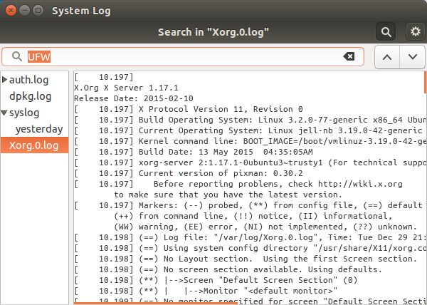
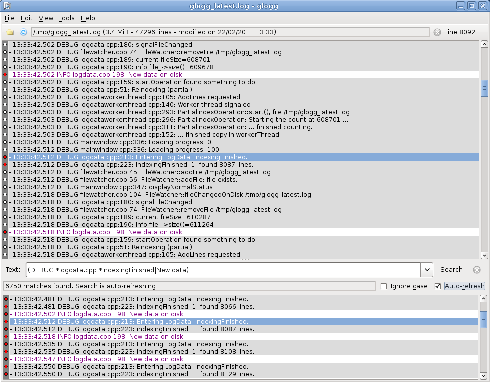

###################
Výkon, dohled, logy
###################

V této závěrečné stručné kapitole se seznámíme s příkazy pro sledování výkonu, programy na
monitoring systému a logování.

****************
Sledování výkonu
****************

time a time
===========

.. todo:: "vestavěný příkaz" odkaz do I. (případně tam přidat sekci vestavěný příkaz vs. externí
   program).

Bash nabízí vestavěný příkaz ``time`` pro přesné měření délky trvání vykonávaných programů.

::

    $ time find ~ -name java
    ...

    real	0m2.686s
    user	0m0.566s
    sys	    0m0.634s

Existuje rovněž program ``time``. Protože koliduje s zabudovaným příkazem Bashe stejného jména,
musíme uvést plnou cestu::

    $ /usr/bin/time find ~ -name java
    ...

    Command exited with non-zero status 1
    0.51user 0.55system 0:01.08elapsed 99%CPU (0avgtext+0avgdata 5852maxresident)k
    0inputs+0outputs (0major+5300minor)pagefaults 0swaps

uptime
======

Jednoduchý prográmek pro zjištění jak dlouho stroj běží a kromě toho zobrazí i aktuální čas,
počet přihlášených uživatelů a průměrnou zátěž za poslední 1, 5 a 15 minut.

.. tip:: Jako "běží" se počítá i suspendace a hibernace.

::
    $ uptime
    14:35:46 up 5 days, 17:30,  2 users,  load average: 1,00, 0,74, 0,54

S parametrem -p vypíše čas podrobněji::

    $ uptime -p
    up 5 days, 17 hours, 30 minutes

.. todo:: všechny odkazy do I. na příslušné sekce

ps, top
=======

S oběma nástroji jsme se již seznámili v prvním díle.

du, ncdu
========

S oběma nástroji jsme se již seznámili v prvním díle.

df
==
S nástrojem jsme se již seznámili v prvním díle.

free
====

Zobrazí velikost volné a použité paměti RAM. Obvyklá volba -h přepne na zobrazení v KiB/MiB/...​
místo bajtů.

::

    $ free -h
                total       used       free     shared    buffers     cached
    Mem:          7,7G       6,9G       759M       871M       302M       3,0G
    -/+ buffers/cache:       3,7G       4,0G
    Swap:          15G       141M        15G

*******************
Programy pro dohled
*******************

Jistě nechcete, aby vám např. spadlý docházkový web oznamoval váš šéf. Proto existuje spousta
aplikací, které vás dovedou informovat na zadaný email/chat o splnění určitých podmínek jako > 90%
zatížení CPU, zaplnění disku, spadlý démon ap.

Tyto aplikace také údaje pomocí agentů nebo veřejných protokolů v pravidelných intervalech sbírají a
nabízejí z nich různé tabulky a grafy.

Bohužel není v možnostech této učebnice projít jednotlivé produkty, proto jen stručně uvedeme
několik nejznámějších systémů s naším subjektivním hodnocením.

.. todo:: jména programů odkazy na jejich weby

* Nagios — nejstarší, nejznámější a nejotřesnější. Nabízí zastaralý vzhled webové UI a složitou
  konfiguraci pomocí souborů
* Icinga — fork Nagiosu, moderní velmi dobře navržené web UI
* Cacti — vyniká ve vytváření grafů z nasbíraných dat. Ovládáním a konfigurací patří ke snadnějším.
* Zabbix — mocný, ale i velmi složitý software. Nulová podpora pro Debian/Ubuntu.
* Munin — jednoduchý monitorovací a sběrací nástroj s grafy. Rychlá a snadná instalace i nastavení.
  Rychlý výsledek.
* Monit a M/Monit — dvojice open-source a komerčního nástroje. Monit je sběrací agent, který může
  volitelně posílat data do centrálního M/Monit serveru. Jednoduchá konfigurace. Doporučujeme, pokud
  jste ochotni zaplatit mírný licenční poplatek.

********
Logování
********

Logování je nesmírně důležitou částí každé aplikace a systému, jakmile dojde na problémy. Ale i bez
nich bychom měli pravidelně prohlédnutí logů věnovat čas. Pohled do logů může odhalit vážné potíže.

Aplikace na linuxovém OS mohou logovat dvěma způsoby

#. aplikace sami vytváří a případně i archivují a rotují textové log soubory
#. aplikace logovací zprávy posílají do centrálního Syslog, který všechny přijaté logy spravuje a
   obyčejně je ukládá také jako textové soubory

Aplikace často dovedou logovat oběma "cestami". Obvyklá složka pro oba zdroje logů je ``/var/log/``.
Pro informace o logování aplikací se obraťte na jejich dokumentaci.

Syslog
======

Asi mnohými správci preferovaný způsob je sjednocené logování Syslog standardem (RFC 1364). (V
Ubuntu jeho moderní implementace `RSYSLOG <http://www.rsyslog.com/>`_). Syslog API nabízí
programátorům aplikací knihovnu pro logování, takže ji nemusí ve své aplikaci řešit sami.

Formát syslog souboru je jednoduchý. Zpráva se skládá z těchto částí:

* druh zprávy (facility) — "od koho"
* důležitost (severity) — od 0 (emenergency nebo emerg), 1 (alert), 2 (crit), 3 (err), 4 (warning), 5 (notice), 6 (info), po nejméně důležitá 7 (debug)
* čas (timestamp) — čas přijetí
* jméno/IP odesílatele
* zpráva samotná

.. code-block:: text
   :caption: Ukázka syslog souboru

   Jan  4 07:16:09 jell-nb kernel: [195311.761217] [UFW BLOCK] IN=wlan0 OUT= MAC=01:00:5e:00:00:01:00:1b:9e:9a:3a:16:08:00 SRC=10.0.0.138 DST=224.0.0.1 LEN=28 TOS=0x00 PREC=0x00 TTL=1 ID=63082 PROTO=2
   Jan  4 07:17:01 jell-nb CRON[13901]: (root) CMD (   cd / && run-parts --report /etc/cron.hourly)
   Jan  4 07:18:14 jell-nb kernel: [195436.406373] [UFW BLOCK] IN=wlan0 OUT= MAC=01:00:5e:00:00:01:00:1b:9e:9a:3a:16:08:00 SRC=10.0.0.138 DST=224.0.0.1 LEN=28 TOS=0x00 PREC=0x00 TTL=1 ID=63098 PROTO=2
   Jan  4 07:19:10 jell-nb dhclient: DHCPREQUEST of 192.168.123.104 on wlan0 to 192.168.123.1 port 67 (xid=0x1260b970)
   Jan  4 07:19:10 jell-nb dhclient: DHCPACK of 192.168.123.104 from 192.168.123.1
   Jan  4 07:19:10 jell-nb dhclient: bound to 192.168.123.104 -- renewal in 1320 seconds.
   Jan  4 07:19:10 jell-nb NetworkManager[1004]: <info> (wlan0): DHCPv4 state changed renew -> renew
   Jan  4 07:19:10 jell-nb NetworkManager[1004]: <info>   address 192.168.123.104
   Jan  4 07:19:10 jell-nb NetworkManager[1004]: <info>   prefix 24 (255.255.255.0)
   Jan  4 07:19:10 jell-nb NetworkManager[1004]: <info>   gateway 192.168.123.1

Pokud byste narazili ještě na klasický Syslog, tak má konfiguraci v ``/etc/syslog.conf``. RSyslog v
Ubuntu používá

* ``/etc/rsyslog.conf`` a
* ``/etc/rsyslog.d/``

Pokud není zkonfigurováno jinak, pak zprávy spadnou do souboru ``/var/log/syslog``.

Prohlížeče logů
===============

System Log Viewer (GUI)
-----------------------

.. todo:: teď se jmenuje Logs

Nainstalovaný v grafickém Ubuntu. Splní základní potřeby.

Glogg (GUI)
-----------

Nutný dodatečně nainstalovat, ale poradí si i obrovskými soubory (několik GB).

Komerční správci logů
---------------------

V posledních letech vznikla řada velmi povedených komerčních správců logů s pokročilým vyhledáváním,
nádherným webovým rozhraním, spoustou funkcí pro lokální provoz i cloudově založených. Namátkou
např.:

* LogMX — desktopová aplikace pro vizualizaci, vyhledávání a sledování logů. Rychlé, snadné ovládání, schopnost pracovat s obrovskými soubory
* Elasticsearch/Logstash/Kibana
* Loggly
* Papertrail