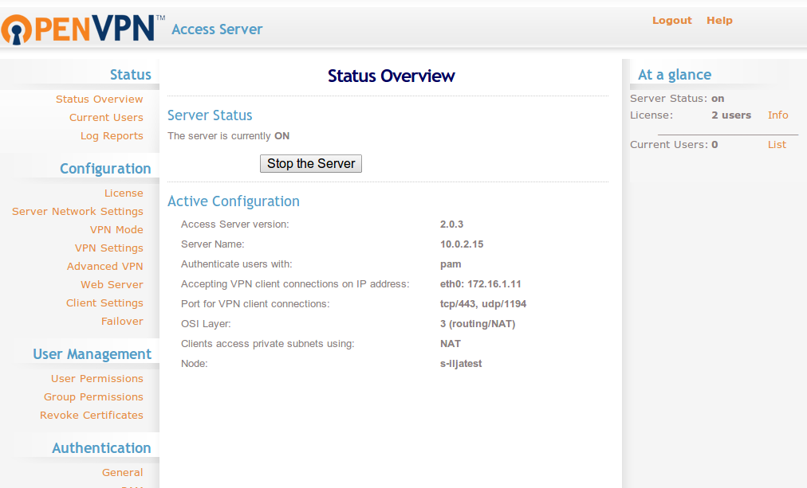
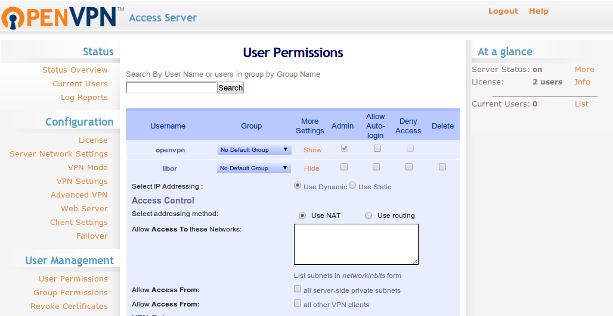
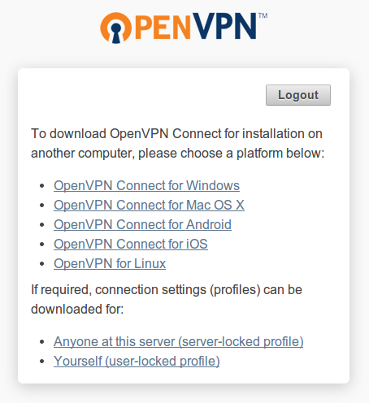

################
Vzdálený přístup
################

.. _SSH:

***
SSH
***

Sada protokolů SSH, konkrétně v Ubuntu implementace `OpenSSH <http://www.openssh.com/>`_, je
nejběžnější a jeden z nejbezpečnějších způsobů přístupu na vzdálený Linuxový server. SSH vytvoří
mezi vámi a vzdáleným počítačem šifrované spojení vhodné nejen pro vzdálený přístup, ale i přenos
souborů.

Na rozdíl od telnetu nebo rcp je celé spojení (včetně zasílání hesla) šifrováno a proto bezpečné i
při přístupu přes internet.

OpenSSH je rozděleno na démona ``sshd`` běžící na serveru a klienta, kterým bývá nejčastěji ``ssh``
pro vzdálený přístup a ``scp`` pro zabezpečený přenos souborů.

OpenSSH podporuje ověřování uživatelů (autentizaci) pomocí více mechanizmů jako jméno-heslo, veřejný
klíč nebo Kerberos. Nejrozšířenější je autentizace pomocí veřejného klíče, kdy se pro uživatele
vygeneruje RSA nebo DSA klíč s veřejnou a soukromou částí.

Instalace
=========

Instalace OpenSSH je velmi jednoduchá a spočívá jen v instalaci balíčku ``openssh-server``, případně
i ``openssh-client``. OpenSSH je rovněž možné vybrat rovnou během instalace Ubuntu Server.

::

    $ sudo apt-get install openssh-client
    $ sudo apt-get install openssh-server

Připojení SSH klientem
======================

Klientský program pro připojení na SSH server se jmenuje prostě ``ssh``. Pro přihlášení ke
vzdálenému terminálu serveru použijte příkaz::

    $ ssh [-p 1084] [<user>@]<server>

kde můžete port (``-p``) můžete vynechat, pokud SSH běží na standardním portu 22. Rovněž
vynecháte-li uživatele, pak se SSH pokusí přihlásit jako aktuální uživatel.

.. rubric:: Jiný klíč

Bude-li vzdálený server požadovat ověření veřejným klíčem, bude je ssh klient hledat váš soukromý
klíč v souboru ``id_dsa`` nebo ``id_rsa`` ve ``.ssh/`` ve vaší domovské složce.

Chcete-li poslat jiný soukromý klíč použijte volbu ``-i``::

    $ ssh -i /path/to/different/private-key user@server-name-or-ip

.. rubric:: Když něco nefunguje

Pokud něco nefunguje hodí se volba ``-v``, kterou zobrazíte ladící zprávy užitečné při odhalování,
co se vlastně děje::

    $ ssh -v [-p 1084] [<další volby>] [<user>@]<server>

Konfigurace SSH serveru
=======================

Hlavní konfigurační OpenSSH serveru je v souboru ``/etc/ssh/sshd_config``. Úplnou dokumentaci
najdete v manuálové stránce zadáním ``man sshd_config``.

.. caution:: Když provádíte změny SSH serveru přes SSH můžete přerušit aktuální spojení nebo až
   při příštím pokuso o připojení zjistit, že se na server už nedostanete. Před jakoukoli změnou
   SSH serveru je proto dobré se ujistit, že máte k serveru jiný přístup.

Změna portu SSH
---------------

Standardní port SSH je 22, ale často se tento port mění z důvodu bezpečnosti na jiný. K tomu stačí
změnit hodnotu proměnné ``Port`` v konfiguračním souboru a pak provést restart SSH.

Ať už standardní port 22 nebo jiný nezapomeňte to ho povolit na :ref:`firewallu <firewall>`.

Zákaz přihlašování heslem
-------------------------

Ve standardní konfiguraci je možné se přihlásit zadáním jména-hesla vzdáleného uživatele. To se hodí
spíše jen v interní síti. Výhodou je, že nemusíme vytvářet a spravovat certifikáty uživatelů. U
serveru viditelného z internetu je bezpečnější autentizaci heslem zakázat a přihlašovat se jen
certifikátem.

Nastavení je opět jednoduché - nastavte ``PasswordAuthentication`` na hodnotu no a proveďte restart
SSH démona.

.. caution:: Ještě, než vypnete ověření heslem, protože chcete použít jen ověření klíčem, měli byste
   mít k serveru fyzický přístup nebo již alespoň jednoho uživatele s klíčem přidaného. Po vypnutí
   hesel totiž již nepůjde použít použít příkaz ``ssh-copy-id`` kopírující klíč na server.

Zákaz SSH přihlášení roota
--------------------------

Další časté nastavení je zákaz přihlášení uživatele root přes SSH. Root tak bude vždy použít fyzický
přístup nebo KVM.

Nastavte klíč ``PermitRootLogin`` na ``no`` a restartujte SSH.

Restart SSH serveru
-------------------

Aby se projevili změny je třeba restartovat SSH démona::

    $ sudo systemctl restart ssh

Založení SSH uživatele
======================

SSH nemá vlastní uživatele - SSH pouze ověřuje, že připojující se uživatel odpovídá již existujícímu
účtu na serveru. Vytvoření SSH uživatele znamená tedy předně vytvoření účtu v OS.

Pokud je povoleno přihlašování :ref:`veřejným klíčem <verejne-klice>`, je třeba pro každého
uživatele vygenerovat klíč a přidat ho do jeho domovské složky do soubory
``~/.ssh/authorized_keys``.

.. _verejne-klice:

Veřejné klíče
=============

Ověřování založené na veřejných klíčích představuje bezpečnější alternativu k přihlašování heslem.
Výhodou je, že uživatel nemusí zadávat svoje heslo a proto se často používá pro přístup ze skriptu a
všude jinde, kde není možné zadat heslo.

Povolení přihlášení veřejným klíčem
-----------------------------------

Ze všeho nejdříve je třeba povolit přihlašování veřejným klíčem nastavením ``PubkeyAuthentication
yes``.

Vygenerování klíčů
------------------

Uživatel na místo hesla používá námi vygenerovanou dvojici veřejného a soukromého klíče. Klíče jsou
běžné textové soubory. SSH klíče mohou používat DSA nebo RSA algoritmus, který je o trochu
rozšířenější.

Pro samotné vygenerování použijte příkaz

::

    $ ssh-keygen -t [rsa|dsa] [-b <početBitů>]

např.::

    $ ssh-keygen -t rsa -b 4096

Parametr ``-t`` určuje algoritmus, ``-b`` počet bitů (standardně se generují 2048 bitové klíče).
Součástí RSA klíčů je i komentář, kam lze vysvětlit účel klíče ap. Defaultně má hodnotu *<aktuální
uživatel>@<počítač>*. Komentář ke klíčí můžete nastavit na vlastní volbou ``-C <komentář>`` (pozor
velké C!).

Budete postupně dotázáni na jméno a další údaje budoucího uživatele. Nejdůležitější otázka je
vybrání *passphrase*, který bude nutné zadat kdykoli při použití klíče. Passphrase může být náhodná
skupina např. 8 znaků nebo věta ap. Pokud má být klíč používán ze skriptu samozřejmě nebudete volit
žádný passphrase. Naopak pro lidské uživatele si vždy dostatečně bezpečný passphrase vymyslete.

Příkaz vytvoří standardně v ``~/.ssh/``:

* soubor veřejného klíče id_rsa.pub (resp. id_dsa.pub pro DSA) a
* soubor soukromého klíče id_rsa (resp. id_dsa pro DSA)

.. caution:: Dejte si velký pozor a nespleťte si veřejný (přípona .pub) a soukromý klíč (bez
   přípony). Soukromý klíč nedávejte z ruky.

Otisk (fingerprint) serveru
---------------------------

Rovněž SSH server má svůj soukromý a veřejný klíč. Dokonce několik dvojic klíčů pro algoritmy jako
DSA, ECDSA, RSA a případně další. Soubory jsou pojmenované jako ``ssh_host_<algoritmus>_key``
(soukromý klíč) a ``ssh_host_<algoritmus>_key.pub`` (veřejný klíč) najdete uložené ve složce
``/etc/ssh/``.

Z veřejného klíče můžeme spočítat tzv. *otisk (fingerprint)*, což je jednoznačná identifikace klíče
reprezentovaná jako krátký hexa kód. Ve skutečnosti to je vlastně jen hash (digest) klíče, který
vypadá např. jako 13:05:84:80:69:d9:81:c5:2d:17:2e:ce:a6:c0:aa:30.

K čemu je to dobré? Díky tomu, že žádné dva různé klíče na světě nemají stejný otisk, se můžete
takto ubezpečit, že identita serveru nebyla pozměněna.

Otisk libovolného veřejného klíče zjistíte programem ``ssh-keygen``. Ten vypíše nejprve počet bitů
klíče, samotný otisk a algoritmus. Např. pro ECSDA klíč serveru::

    $ ssh-keygen -lf /etc/ssh/ssh_host_ecdsa_key.pub
    256 13:05:84:80:69:d9:81:c5:2d:17:2e:ce:a6:c0:aa:30 root@stkfactory (ECDSA)

.. tip:: ECDSA otisky vašich SSH serverů byste si měli poznamenat. SSH klient (program ``ssh``) se
   zeptá, jestli je ECDSA otisk správný, když se připojujete poprvé nebo když se změní klíče na
   serveru (z důvodu přeinstalace, ale i eventuálního napadení).

Přidání SSH klíče na server
---------------------------

Veřejný klíč ``id_rsa.pub`` (resp. ``id_dsa.pub`` ap.) se pak musí nakopírovat na server, aby mohl
SSH démon ověřit identitu porovnáním veřejného klíče a uživatelova soukromého klíče přítomném pouze
na klientově počítači.

SSH server dívá do ``~/.ssh/authorized_keys`` domovské složky uživatele pod kterým se pokoušíme
připojit. Když se připojujeme jako ``ssh tomas@server``, hledá se v souboru
``/home/tomas/.ssh/authorized_keys``.

SSH může pro jednoho uživatele serveru evidovat více veřejných klíčů, ale pokud doržujeme, že
uživatelé by neměli sdílet společný účet, pak je většinou v souboru ``~/.ssh/authorized_keys``
uložen jen jeden klíč.

Běží-li SSH na standardním portu 22 použijte::

    $ ssh-copy-id <username>@<server>

V případě, že SSH naslouchá na jiném portu je syntaxe trochu složitější. Případně můžete zadat jinou
cestu k veřejnému klíči. Dohromady např..:

    $ ssh-copy-id -i <cesta/k/id_rsa.pub> '-p <port> <username>@<server>'

Při prvním přístupu nás SSH vyzve k potvrzení identity vzdáleného serveru (jeho fingerprintu).
Musíme napsat ``yes`` a stisknout :kbd:`Enter`. Pokud není autentikace heslem vypnutá, může být
třeba zadat heslo vzdáleného uživatele.

.. note:: Program ``ssh-copy-id`` ve skutečnosti neudělá nic jiného, než přidání obsahu veřejného
   klíče do ``~/.ssh/authorized_keys``. Proto může být někdy jednodušší dostat klíč na server a na
   serveru::
   
       $ cat mujklic.pub >> ~/.ssh/authorized_keys
   
   Nebo otevřít ``authorized_keys`` v editoru na serveru a řádek přidat přes copy-paste schránkou.

Odebrání klíče
--------------

.. caution:: Pouhé zakázání účtu uživatele v OS (``passwd -l``) nestačí! Pokud je uživatelům
   veřejný klíč stále v ``~/.ssh/authorized_keys``, může se i nadále přihlásit. Podobně zakaz účtu
   nepřeruší SSH spojení, je-li uživatel právě připojen.

Pro zrušení SSH přístupu přístupu stačí jen přejmenovat složku ``~/.ssh/`` na název, který
SSH server neočekává.

Když jen skončila např. platnost klíče musíme otevřít ``~/.ssh/authorized_keys`` ručně zde odebrat
starý veřejný klíč.

SSH tunneling
=============

SSH je rovněž použít pro vytvoření zabezpečeného tunelu z našeho počítače na vzdálený. Tunel funguje
tak, že ssh na lokálním PC vytvoří port, který bude namapován na specifikovaný port vzdáleného
serveru. Lokální aplikace se připojují lokálně, ale ve skutečnosti je provoz přesměrován na port
vzdáleného serveru. Podobně vzdálené aplikace netuší, že připojení k nim je iniciováno ze jiného,
než místního PC.

Tímto lze obejít řadu omezeních jako např. u MySQL/MariaDB serveru, který defaultně neumožňuje jiná
připojení, než localhostu.

Vytvoření tunelu v SSH má syntaxi::

    ssh -Ng -L <lokalniPort>:localhost:<vzdalenyPort> [-p <portSSH>] [<user>@]<server>

kterou lze číst jako "vytvoř SSH spojení na <server>, a současně naslouchej na portu <lokalniPort>
mého počítače, a přesměruj všechna spojení na tento port na <vzdalenyPort> serveru".

.. 
   Časté chyby
   ===========
   
   Error: Bad file number
   ----------------------

   Tato chyba obvykle znamená, že se SSH klient (ssh) nedokázal spojit se serverem. Typickým
   důvodem je restriktivní firewall nebo proxy server.

*******
OpenVPN
*******

`OpenVPN <https://openvpn.net/>`_ je linuxovým de facto standardem pro vytváření VPN řešení. Je to
roky ověřený open source, aktivně vyvíjený, dostupný přímo z Ubuntu repozitářů, flexibilní,
spolehlivý a bezpečný VPN software. Používá SSL/TLS typ VPN (jinou možností jsou IPSec VPNky).

OpenVPN Access Server
=====================

Je snadnějším VPN řešením postaveným nad OpenVPN, které tvoří OpenVPN server, webové administrační
rozhraní a klient. Vytvoření VPN s OpenVPN Access Serverem je mnohem méně složité, než s tradičním
OpenVPN. Kromě toho Access Server nabízí i klienty pro Android a iOS.

OpenVPN Access Server je pro první dva uživatele zdarma. Poté vyžaduje zakoupení licence, která však
stojí opravdu minimálně a bezstarostnost Access Serveru oproti tradiční OpenVPN určitě vyváží.

Instalace
---------

#. Z webu OpenVPN si stáhněte a nainstalujte OpenVPN Access Server balíček pro Ubuntu (.deb soubor)::

    $ sudo dpkg -i openvpn-as-<verze>.deb

#. Access Server se nainstaloval do do ``/usr/local/openvpn_as``. Konfigurační log najdete v
  ``/usr/local/openvpn_as/init.log``.
#. Byl založen uživatel ``openvpn``. Musíme mu nastavit heslo pomocí ``sudo passwd openvpn``.
#. Webová administrace běží na ``https:<server>:943/admin``, uživatelská část na
   ``https:<server>:943/``.
#. Pro pozdější manuální rekonfigurací můžeme použít nástroj ``/user/local/openvpn_as/ovpn-init``.

Konfigurace
-----------

Přihlaste se do OpenVPN Access Server administrace. Minimálně budeme chtít vytvořit nějaké VPN
uživatele v sekci :menuselection:`User Permissions`. V defaultní konfiguraci musí uživatelé
odpovídat uživatelům v OS (PAM autentizace).

OpenVPN Access Server klienti
-----------------------------

Všechny uživatele nasměrujte na ``https://<server>:943/``, kde se musí přihlásit svým jménem a
heslem (heslem pro OS v případě defaultní konfigurace) a poté si vyberou stažení OpenVPN klienta pro
jejich operační systém.

V případě Ubuntu stačí provést ``sudo apt-get install openvpn``.

Rovněž si nainstalujte OpenVPN plugin pro GUI správce sítě pro snadné vytvoření OpenVPN spojení::

    $ sudo apt-get install network-manager-openvp network-manager-openvp-gnome
    $ sudo service network-manager restart